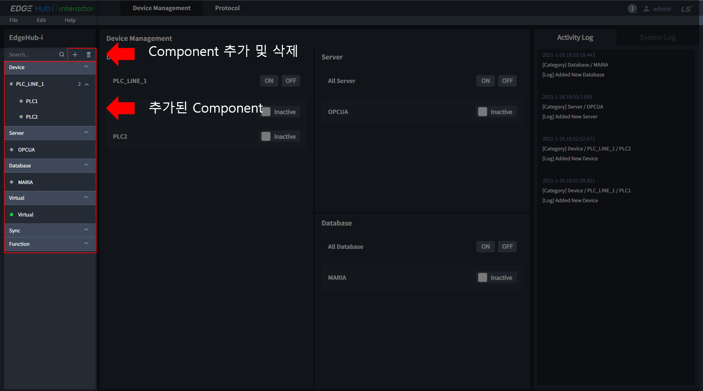
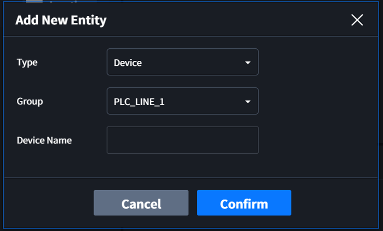
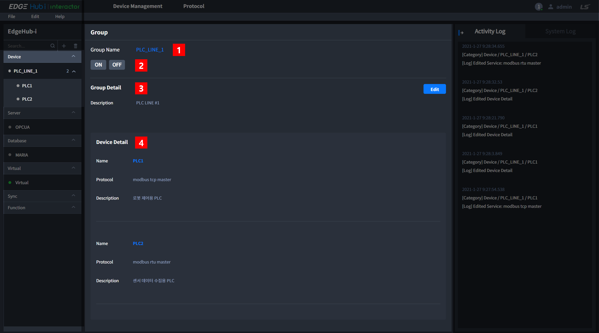
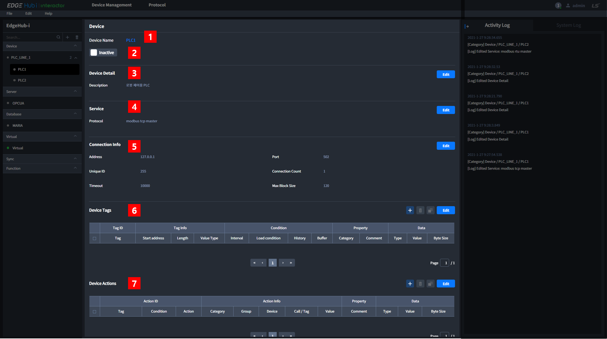

# Component

Interactor에서는 다양한 Category의 Component를 추가할 수 있습니다.
* PLC 등 수집 대상의 기기 연결 및 설정: Device
* 수집된 데이터의 가공: Virtual, Sync, Function
* 데이터베이스 연결: Database
* 데이터 전달을 위한 서버 기능 설정: Server

## Component 추가
화면 왼쪽의 Navigation에서 Component를 추가하거나 삭제할 수 있습니다.  

`+` 버튼을 클릭하면 아래와 같은 Modal 창이 나타납니다. Device Component는 사용자의 편의성을 위해서 Group으로 구분하여 추가할 수 있습니다. 다른 Component는 Group 없이 Category에 추가됩니다.  

::: tip 입력 조건
Component 이름은 영문자, 숫자 그리고 일부 특수문자를 사용할 수 있습니다.  
(사용 불가능한 특수 문자 - comma(,), period mark(.) 그리고 space( ))
:::

## Device
Device는 PLC와 같이 데이터 수집의 대상이 되는 기기를 추가합니다.  
추가된 Device는 화면 왼쪽 Navigation의 Device Category에서 확인할 수 있습니다.  
Group 이름 또는 Device 이름을 클릭하면 해당 페이지가 출력됩니다.  

### Gruop page
선택한 Group과 Group에 속해있는 Device의 정보가 출력됩니다.

#### 1. Group Name  
사용자가 설정한 Group 이름입니다.

#### 2. Group ON / OFF Button
Group에 속한 모든 Device와 Edgehub 통신을 시작하거나 중지하는 버튼입니다.  
ON 버튼 클릭 시 통신이 중지되어 있는 Device와 통신을 시작하며, OFF 버튼 클릭 시 모든 Device와의 통신을 중지합니다.  
버튼은 Device들의 통신 상태를 나타내지 않습니다.  

#### 3. Group Detail
Group에 대한 세부내용을 입력하고 확인할 수 있습니다.
::: tip 입력 조건
문자 제한 없이 최대 100글자까지 입력할 수 있습니다.
:::

#### 4. Device Detail
Group에 속한 Device들의 이름, 프로토콜 그리고 사용자가 Device 설정 시 입력한 세부내용이 출력됩니다.

### Device page
데이터 수집의 대상이 되는 기기를 설정하고, 수집되는 데이터를 보여주는 페이지 입니다.

#### 1. Device Name
사용자가 설정한 Device 이름입니다.

#### 2. Device ON / OFF Button
모든 Device와 Edgehub 통신을 시작하거나 중지하는 버튼입니다. 
Inactive는 통신이 중지되어 있는 상태이며, Active는 통신 중 또는 통신 시도 중인 상태 입니다.  
버튼은 Device의 통신 상태를 나타냅니다.  

#### 3. Device Detail
Device와 관련된 정보를 사용자가 직접 입력하고 확인할 수 있습니다.
::: tip 입력 조건
문자 제한 없이 최대 100글자까지 입력할 수 있습니다.
:::

#### 4. Service
Device와 통신을 위한 프로토콜을 선택합니다.  
7가지의 built-in 프로토콜 또는 사용자가 직접 작성한 프로토콜을 선택할 수 있습니다. (2021년 1월 기준)  

##### Built-in Protocol
* OPC UA
* Modbus TCP
* Modbus RTU
* MELSEC SERIAL
* MELSEC ETHERNET
* FENET
* CNET

#### 5. Connectoin Info
선택한 Protocol 사용에 필요한 접속 정보를 입력합니다.   
Protocol마다 필요한 정보가 다르며, 자세한 내용은 Protocol 설명 페이지를 참고해 주세요.  

#### 6. Device Tags
Edgehub에서는 Device에서 수집된 데이터를 Tag 로 분류합니다.  
Device Tags 테이블에서는 Device에서 데이터를 수집하고 Tag로 저장하기 위해 필요한 정보를 입력합니다.  
* Tag: 수집된 데이터를 분류하고 사용하기 위해 Edgehub에서 부여하는 이름입니다.
* Tag info: 수집을 위해 필요한 Device와 관련된 정보를 설정합니다. Protocol에 따라 필요한 정보가 다릅니다.
* Interval: Tag 마다 설정할 수 있는 수집 주기입니다. 단위는 ms 입니다.
* Load condition: 데이터를 수집하여 Edgehub inner database에 저장하는 기능을 사용할 때 저장하는 조건입니다.
입력 조건을 만족하지 않으면 저장하지 않고, 입력 조건이 없으면 항상 저장합니다.  
(Inner database를 사용할 때)
* History: Edgehub inner database에 저장 기능 사용 여부를 결정하는 버튼입니다. Inner database가 설정되어 있고, Enable을 선택하면 저장기능을 사용하고, Inner database가 설정되어 있지 않거나 Disable를 선택하면 저장기능을 사용하지 않습니다.
* Buffer: Tag 마다 저장할 수 있는 개수를 설정합니다. 최대 X 까지 입력 가능합니다.
* Category: Tag의 Category를 구분하기 위한 정보를 입력합니다. 사용자가 필요한 경우 입력합니다. (Option)
* Comment: Tag와 관련된 정보를 입력합니다. 사용자가 필요한 경우 입력합니다. (Option)
* Type: Tag value의 Type입니다. 선택된 Type에 따라 데이터가 Value에 출력됩니다.
* Value: 수집된 Tag의 value 입니다. 수집주기와 무관하게 1s마다 값이 갱신됩니다.
* Byte Size: Value에 출력되는 값의 byte size 입니다.

#### 7. Device Actions

## Server

## Database

## Virtual

## Sync

## Function