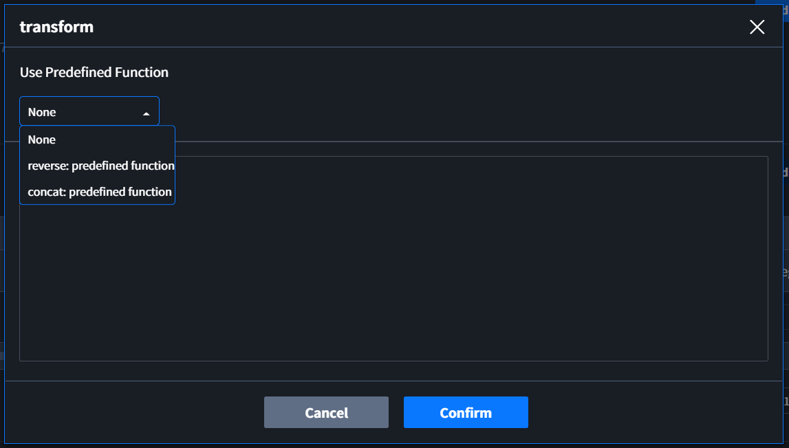

# Details

이 페이지는 EdgeHub-i | Interactor의 세부 기능을 설명합니다.

## Transform
수집된 데이터를 Tag에 저장하기 전 pre-processing을 위해 사용합니다. 각 Component의 Tags Table 의Condition column에서 입력할 수 있습니다. 사용 방법은 다음과 같습니다.  
* Predefined Function 사용  


Transform을 사용하기 위한 가장 간단한 방법입니다.  
Transform Modal에서 상단에 위치한 "Use Predefined Function" 에서 function을 선택합니다.  
"Use Predefined Function"의 function은 EdgeHub 개발 시 정의된 function 입니다.  
선택된 function은 text 입력창에서 확인할 수 있습니다. 
::: warning
Confirm을 클릭하기 전 text 입력창을 클릭하면 선택된 Predefined Function의 선택이 취소됩니다.  
Dropdown에서 선택하지 않고 text 입력창에 직접 입력한 내용은 Predefined Function으로 사용될 수 없습니다.
:::
[수정예정: Use Predefined Function 설명 추가]  


* User Defined Function 사용  
EdgeHub에서 사용자가 생성한 Function을 사용하는 방법입니다.
"Use Predefined Function"이 None인 상태에서 text 입력창에 사용을 원하는 function을 입력합니다.  
입력 예시  
```
EdgeHub.function("AAA.reverse", [argument: v])
```
::: tip 입력 조건
Pre-processing을 위한 데이터는 v로 정의되어 있습니다.
:::

* Elixir 사용