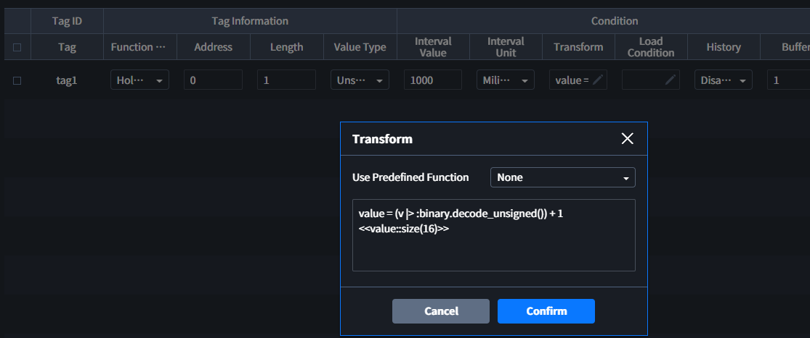
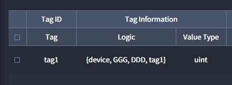

# Details

이 페이지는 EdgeHub-i | Interactor의 세부 기능을 설명합니다.

## Transform
수집된 데이터를 Tag에 값을 맵핑하기 전 전처리(pre-processing)를 위해 사용합니다. 각 Component의 Tags Table 의Condition column에서 입력할 수 있습니다. 사용 방법은 다음과 같습니다.  
### 1. Predefined Function 사용  


Transform을 사용하기 위한 가장 간단한 방법으로 등록된 function을 사용할 수 있습니다. Transform Modal에서 상단에 위치한 "Use Predefined Function" 에서 function을 선택합니다. 선택된 function은 text 입력창에서 확인할 수 있습니다. 
::: warning
Confirm을 클릭하기 전 text 입력창을 클릭하면 선택된 Predefined Function의 선택이 취소됩니다.  
:::


### 2. User Defined Function 사용  
EdgeHub에서 사용자가 생성한 함수를 사용하는 방법입니다. "Use Predefined Function"이 None인 상태에서 text 입력창에 사용을 원하는 함수를 입력합니다. 사용자 생성 함수의 자세한 사용법은 (작성예정)을 참고주세요.   
입력 예시  
```
EdgeHub.function("AAA.reverse", [argument: v])
```
::: tip 입력 조건
Tag의 Value는 v로 정의되어 있습니다.
:::

### 3. Elixir 사용
Elixir Syntax를 직접 입력하여 전처리를 수행할 수 있습니다. 전처리를 위한 Tag의 값은 v 로 정의되어 있으며, 데이터가 value type이 적용되기 전 raw인 것에 주의하여 Elixir Syntax를 적용해야 합니다.

#### Example1) Modbus TCP Protocol을 사용하는 Device에서 수집된 데이터에 1을 더하고 싶을 때
Modbus TCP 프로토콜로 1 word의 데이터 257을 수집하면, 수집된 값인 Raw는 <<1, 1>와 같은 형태의 Binary 데이터가 됩니다.
10진수 257은 hex로 표현하면 0x0101이고, 이를 Elixir의 바이너리 형태로 표현하면 <<1, 1>> 입니다. 
::: tip Elixir의 Binary
Elixir의 Binray 데이터는 << >> 를 사용하여 표현합니다.  
<< >> 안에는 10진수를 1바이트로 Comma(,)로 구분되어 나열됩니다.  
<<1, 0, 255>>
:::
Raw 형태인 <<1, 1>>에서 1의 값을 더하기 위해서는 10진수로 변환이 필요합니다. <<1, 1>>와 같은 Tag의 값은 v로 정의되어 있습니다.
Binary 를 Uisigned Integer로 변경하기 위한 Elixir 함수는 :binary.decode_unsigned() 입니다.
```
v |> :binary.decode_unsigned()
```
Binray 값을 unsigned interger로 변경하는 코드를 위와 같이 적용하면 결과가 257이 됩니다. 여기서 + 1을 하기 위해서는
```
(v |> :binary.decode_unsigned()) + 1
```
을 실행하면 258이 됩니다.  
원하는 전처리를 수행한 후에는 처음의 데이터 형태인 Binary로 변경을 해야 합니다. 위의 연산을 Value리는 변수에 넣고, 그 변수를 16비트 바이너리 값으로 변경하는 코드를 작성하면 원하는 값인 <<1, 2>>을 만들 수 있습니다. Number를 Binary로 변경하기 위한 Elixir 함수는 <<대상::size(비트크기)>> 입니다.
```
value = (v |> :binary.decode_unsigned()) + 1
<<value::size(16)>>
```

위 예제는 Interactor에 다음과 같이 적용됩니다.



#### Example2) Virtual Tag에 1을 더하고 싶을 때
Virtual Tag에 직접 값을 입력하거나 다른 Tag의 값을 가지고 올 때는 Binary 형태가 아닌 Value 형태가 적용됩니다.
  
{device, GGG, DDD, tag1}의 value는 <<>>가 아닌 Value type이 적용된 값을 가집니다. 이 때의 값이 1이라면, 예제 1번과 같이 데이터 타잎을 변환하는 코드 없이 원하는 계산을 바로 입력하면 원하는 결과인 2를 만들 수 있습니다.  
```
v + 1
``` 

위 예제는 Interactor에 다음과 같이 적용됩니다.

