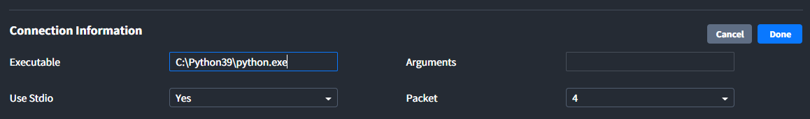
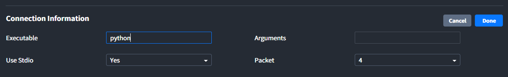
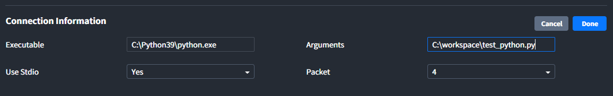

# Port
이 페이지는 <u>Edgegub-i | Interactor Web Application(이하 Interactor)</u>의 `Custom Protocol`을 이용한 `Port` 사용법을 설명합니다.

<div class="toc-title">Table of Contents</div>

[[toc]]

## Connection Information

#### :black_medium_square: Executable

Executable에는 실행 파일(`.exe`)의 <u>path</u> 또는 <u>명령어</u>를 입력합니다.

- 환경변수가 설정되어 있지 않은 경우 아래와 같이 실행파일의 full path를 입력합니다.
``` bash
C:\Python39\python.exe
```


- 환경변수가 설정되어 있는 경우 아래와 같이 실행파일의 이름을 입력합니다.
``` bash
python
```


#### :black_medium_square: Arguments
Arguments에는 실행파일을 통해 실행하고자 하는 <a href="#elixir_port">**파일**</a>의 path를 입력합니다.
``` bash
C:\workspace\test_python.py
```



#### :black_medium_square: Use Stdio
Select box에서 `Standard Input/Output`의 사용여부를 선택할 수 있습니다.
- **Yes(사용)**: 표준입출력을 통해 외부 프로그램과 데이터를 송수신합니다.
- **No(미사용)**: 표준입출력을 사용하지 않고 port만 실행합니다(Tag 사용불가).

#### :black_medium_square: Packet
송수신할 데이터의 Length를 실어 보낼 Header의 Byte 길이를 지정합니다. 설정한 Header를 통해 데이터의 Length를 확인하고, 그 Length만큼 데이터를 읽거나 씁니다(**N = Data Length**).  

::: tip <p class="custom-block-title">NOTICE</p>
1 Byte는 8 bit이며, 8 bit는 binary로 255까지 표현할 수 있습니다.
:::

| Packet | Header | 예) N = 255 | 예) N = 256 | 예) N = 16777216 |
| :-: | -:| -: | -: | -: |
| 0 | - | - | - | - |
| 1 | N | 255| - | - |
| 2 | 0&nbsp;&nbsp;&nbsp;&nbsp;N | 0&nbsp;&nbsp;&nbsp;&nbsp;255 | 1&nbsp;&nbsp;&nbsp;&nbsp;0 | -  |
| 4 | 0&nbsp;&nbsp;&nbsp;&nbsp;0&nbsp;&nbsp;&nbsp;&nbsp;0&nbsp;&nbsp;&nbsp;&nbsp;N | 0&nbsp;&nbsp;&nbsp;&nbsp;0&nbsp;&nbsp;&nbsp;&nbsp;0&nbsp;&nbsp;&nbsp;&nbsp;255 | 0&nbsp;&nbsp;&nbsp;&nbsp;0&nbsp;&nbsp;&nbsp;&nbsp;1&nbsp;&nbsp;&nbsp;&nbsp;0 | 1&nbsp;&nbsp;&nbsp;&nbsp;0&nbsp;&nbsp;&nbsp;&nbsp;0&nbsp;&nbsp;&nbsp;&nbsp;0 | 

##### :mag_right: 예시) Interactor로 `hello`를  보내는 경우(Elixir)
``` elixir
# Tag Info - Value Type: String-ASCII
# hello의 length: 5
# hello의 ASCII Code: 104, 101, 108, 108, 111

# Packet 0
<<104, 101, 108, 108, 111>>

# Packet 1 
<<5, 104, 101, 108, 108, 111>>

# Packet 2
<<0, 5, 104, 101, 108, 108, 111>>

# Packet 4
<<0, 0, 0, 5, 104, 101, 108, 108, 111>>
```

::: tip <p class="custom-block-title">NOTICE</p>
`<< >>`는 binary를 의미합니다. 자세한 내용은 [Elixir Syntax의 Binary](../elixir/binary.md)를 참고 바랍니다.
:::

## Tags
#### :black_medium_square: Tag Information
- **Custom information**: Custom Protocol 생성 시 Protocol Builder 페이지에서 추가한 Tag Information의 내용 
- **Value Type**: Interactor로 수신되는 `json`구조의 데이터에서 key가 `Value`인 데이터의 Value Type
``` json
{
  "id": 309669,
  "value": "hello" // String-ASCII
}
```

#### :black_medium_square: Data
- **Type**: Data - Value에 출력되는 데이터의 종류 설정 (Raw, Binary, Value 중 선택)
- **Value**: 마지막으로 수신된 Tag 값 (Type 설정 적용)
- **Byte Size**: 마지막으로 수신된 Tag Value의 Byte 길이

##### :mag_right: 예시) Interactor에서 전달하는 Data의 Structure(`json`)
``` json
{
  "id": 309669,
  "data": {
    "tagInfo": { 
      "msg": "hello" // custom protocl을 통해 만든 tag information
    },
    "command": "read_tag"
  }
}
```
##### :mag_right: 예시) Interactor에서 수신하는 Data의 Structure(`json`)
``` json
{
  "id": 309669,
  "value": "hello"
}
```

<div id="elixir_port"><h5>🔎 예시) <code>.exe</code>파일을 통해 실행되는 Elixir 코드 예제</h5></div>

``` elixir
defmodule PortWithElixir do
  @packet_byte 4
  @packet_bit 8

  def main(_) do
    # Interactor에서 받은 데이터를 local에 저장하기 위해 json 파일 생성
    file_path = "C:/workspace/port_with_elixir/interactor.json"
    File.open(file_path, [:write])
    # Port를 열어 Interactor와 데이터를 주고 받음
    communication_loop(file_path)
  end

  def communication_loop(file_path) do
    # Interactor에서 보내는 데이터를 가져옴(Read)
    get_info(file_path)
    # Interactor로 보낼 데이터를 가공한 뒤 보냄(Write)
    file_path |> decode_json |> encode_json |> parse_binary |> send_data
    # Loop
    communication_loop(file_path)
  end

  def get_info(file_path) do
    # Packet_Byte만큼 데이터를 읽어 Interactor에서 보내는 데이터의 길이를 얻어옴
    length = IO.read(:stdio, @packet_byte) |> :binary.decode_unsigned
    # 데이터의 길이만큼 잘라서 데이터를 읽음
    data = IO.read(:stdio, length)
    # 읽은 데이터를 local의 json 파일에 저장
    File.write(file_path, data, [:write])
  end

  def decode_json(file_path) do
    # json 형식의 파일을 Map 형태로 decode
    file_path |> File.read! |> Poison.decode!
  end

  def encode_json(data_from_interactor) do
    # Tag Information의 'msg'의 값에 " world"를 추가해서 String 형태로 encode
    msg = data_from_interactor["data"]["tagInfo"]["msg"]
    data_from_interactor |> Map.delete("data") |> Map.put("value", msg <> " world") |> Poison.encode!
  end

  def parse_binary(data_to_interactor) do
    # (Interactor로 보낼 데이터의 길이 + 데이터)를 binary type으로 변환
    length = data_to_interactor |> String.length
    <<length::@packet_byte * @packet_bit>> <> data_to_interactor
  end

  def send_data(data_to_interactor_binary) do
    # Interactor로 데이터 송신
    IO.write(:stdio, data_to_interactor_binary)
  end

end
```