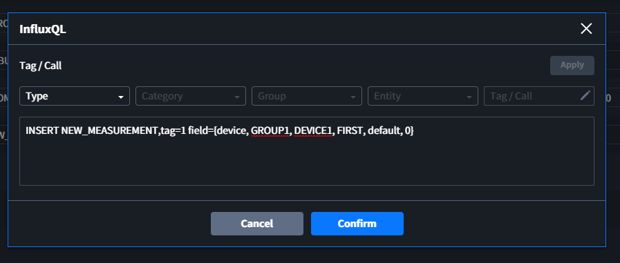
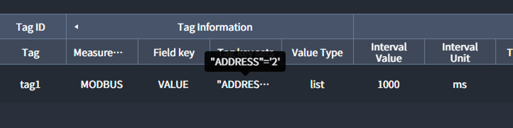

# InfluxDB
InfluxDB와 <u>Interactor</u>를 연결하여 DATABASE에 데이터를 WRITE, READ할 수 있습니다.

::: tip <p class="custom-block-title">NOTICE</p>
Calls의 InfluxQL을 이용하여 WRITE, READ가 모두 가능하지만 특정 데이터만 READ하기 위해서는 Virtual[(예제)](#example)을 이용해야 합니다. 이러한 특성에 따라 Calls은 WRITE를 위한 목적으로 사용할 것을 권장합니다. 
:::

## Connection Information
`Connection Information`은 InfluxDB의 configuration입니다.

| Key | Description |
| :- | :- |
| _Address_ | InfluxDB가 저장된 Device의 IP Address |
| _Port_ | InfluxDB의 http service Port |
| _Database_ | 가져오고자 하는 데이터의 DATABASE 이름 |
| _Username_ | DATABASE의 Username(User가 없는 경우 space 입력하여 설정) |
| _Password_ | DATABASE의 Password(User가 없는 경우 space 입력하여 설정) |
| _Precision_ | DATABASE에 설정된 Timestamp의 시간 정밀도 |  

::: warning <p class="custom-block-title">WARNING</p>
- 다른 프로그램에서 같은 번호의 `Port`를 사용하고 있을 시 연결된 상태로 확인될 수 있습니다.
- _Username_/_Password_ 가 틀렸을 시, `Calls`의 Read한 데이터의 `status_code`가 `403`으로 응답되며, `error authorizing ...`과 같은 error message가 확인됩니다.
:::

## Calls

### InfluxQL
#### **INSERT**: Measurement에 데이터 Insert/Rewrite(Update)
##### 예시) NEW_MEASUREMENT에 `{tag reference}`로 가져온 데이터 추가
``` sql
INSERT NEW_MEASUREMENT,tag=1 field={device, GROUP1, DEVICE1, FIRST}
```

::: warning <p class="custom-block-title">WARNING</p>
InfluxDB의 Field는 이전에 사용된 데이터타입과 다른 데이터타입은 허용하지 않습니다. **새로운 Field**에 **Number Type의 Data**를 `Tag Reference`를 이용하여 Insert할 경우, 데이터를 가져오는 동안 `null`이 임시로 저장되기 때문에 데이터 타입 에러가 납니다. 그러므로 다음과 같이 **default** 값을 반드시 세팅하여 주시기 바랍니다.

:::

#### **DELETE**: Measurement의 데이터 삭제
##### 예시) ADDRESS가 '5'인 데이터 삭제
``` sql
DELETE FROM MODBUS WHERE ADDRESS='5'
```
#### **SELECT**: Measurement의 데이터 조회
##### 예시) MODBUS에서 가장 최신 데이터 조회
``` sql
SELECT * FROM MODBUS order by desc limit 1
```

<div class="spacer-sm"/>

### Retention
지난 데이터들을 자동으로 만료시키는 interval을 설정합니다(InfluxDB의 Retention Policy). 

<div class="spacer-sm"/>

### Consistency
데이터 Write의 일관성 수준(**all | any | one | quorum**)을 설정합니다.

### Response Data Structures
#### INSERT 
``` json
{"status_code":204,"body":""}
```

#### DELETE
``` json
{"status_code":200,"body":{"results":[{"statement_id":0}]}}
```

#### SELECT
``` json
{
  "status_code": 200,
  "body": {
    "results": [
      {
        "statement_id": 0,
        "series": [
          {
            "values": [ // measurement의 DATA
              [
                "1970-01-01T00:00:00.000012345Z",
                "'MIKE'",
                20
              ],
            ],
            "name": "MYDB", // DATABASE 이름
            "columns": [
              "time", // default column
              "NAME", // Tag Key
              "AGE"  // Field Key
            ]
          }
        ]
      }
    ]
  }
}
```

## Tags
### Tag Information

| Key | Description | required | 
| :- | :- | :-: |
| _Measurement_ | Data가 저장된 Measurement 이름 | * |
| _Tag key sets_ | Field key와 함께 가져오고 싶은 Tag key |  |
| _Field key_ | 조회하고자 하는 Field key | * |
| _Value Type_ | List로 데이터 Read(Condition의 transform을 사용한 경우는 제외) | * |

::: tip <p class="custom-block-title">NOTICE</p>
`Tag Key sets`는 다음과 같이 사용합니다(key: 큰따옴표`" "`, value: 작은따옴표`' '`).

:::

### Condition
#### Transform
List로 전달되는 데이터를 변환 및 가공하여 특정 데이터만 Read할 수 있습니다. 

##### 예시) 특정 데이터만 Read하고 싶은 경우
- Database의 Tags를 통해 Read되는 Data Structure
``` elixir
[%{
    "series" => [%{
        "columns" => [
          "time",
          "VALUE"
        ],
        "name" => "MODBUS",
        "values" => [
          [
            "2021-06-21T01:19:52.6980444Z",
            10
          ]
        ]
      }
    ],
    "statement_id" => 0
  }
]
```
- `Condition > Transform ` 설정

``` elixir
# 'VALUE' column의 값만 가져오고 싶은 경우
v |> List.first |> Map.get("series") |> List.first |> Map.get("values") |> List.flatten |> List.last
```

`Value Type`을 `Signed Integer`로 설정하면 `Data > Value`에서 10을 확인할 수 있습니다. 


## Example
##### 예시) 가장 최근에 저장된 Database의 값을 가져오고 싶은 경우

- `Database > Calls > Call Information > InfluxQL`
``` sql
SELECT * FROM MODBUS ORDER BY DESC LIMIT 1
```

- `Virtual > Tags > Tag Information > Logic`
``` elixir 
v |> Map.get("body") |> Map.get("results") |> List.first |> Map.get("series") |> List.first |> Map.get("values") |> List.flatten
```
::: tip <p class="custom-block-title">NOTICE</p>
Interactor에서 제공하는 Function을 사용하면 다음과 같이 보다 간결하게 값을 가져올 수 있습니다.
``` elixir 
v |> Interactor.Object.get_in( ["body", "results","0", "series","0","values"]) |> List.flatten
```
:::


## InfluxDB Configuration

### Port
``` conf
# The bind address used by the HTTP service.
# bind-address = ":8086"
```
### Username & Password
아래의 내용을 `true`로 변경하면 Username & Password를 사용할 수 있습니다.
```
# Determines whether user authentication is enabled over HTTP/HTTPS.
# auth-enabled = false
```

### Precision

``` config
# InfluxDB precision for timestamps on received points ("" or "n", "u", "ms", "s", "m", "h")
# precision = ""
```

### Retention

``` config
# Automatically create a default retention policy when creating a database.
# retention-autocreate = true

[retention]
  # Determines whether retention policy enforcement enabled.
  # enabled = true

  # The interval of time when retention policy enforcement checks run.
  # check-interval = "30m"
```
### Consistency
- **all**: 쓰기가 모든 클러스터 멤버에 도달 한 경우에만 성공
- **any**: 쓰기가 클러스터 멤버에 도달하면 쓰기가 성공.
- **one**: 쓰기가 하나 이상의 클러스터 멤버에 도달하면 쓰기가 성공
- **quorum**: 쓰기는 쓰기가 클러스터 구성원의 쿼럼에 도달한 경우에만 성공
```
[[opentsdb]]
  # consistency-level = "one"
```