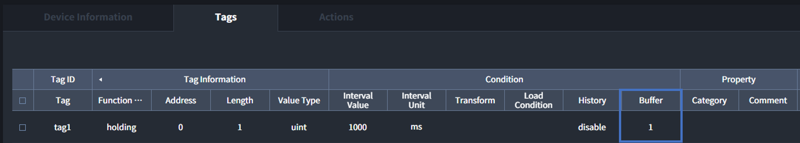
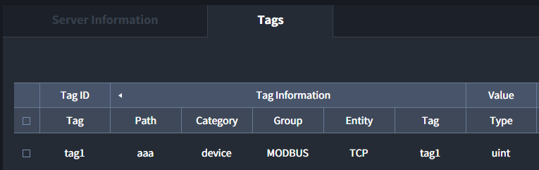
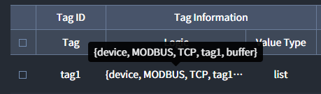

# Buffer
Interactor의 Tag는 기본적으로 **마지막에 수집된 또는 생성된 데이터**를 가지고 있습니다. 하지만 마지막 데이터 이전에 수집된 데이터가 필요한 경우 Buffer를 사용하여 데이터를 읽을 수 있습니다. Interactor는 설정된 **Buffer 크기 만큼 이전 데이터를 휘발성 데이터**로 가지게 됩니다.  

## Buffer 설정
Buffer는 `Device`, `Database` `Virtual`의 Tags에서 설정할 수 있습니다. **최소 1 부터 최대 1000**까지 설정 가능합니다.

::: warning <p class="custom-block-title">WARNING</p>
많은 Tag가 큰 숫자의 Buffer를 가지면 Interactor 및 Interactor를 사용하는 PC의 성능에 영향을 줄 수 있습니다.
:::




## Buffer의 데이터 읽기
Buffer를 사용하여 저장된 데이터는 `HTTP`와 `Tag reference`에서 읽을 수 있습니다.

### 1. HTTP and HTTPS
Buffer에 포함된 모든 데이터를 한번에 읽는것과 특정 순서의 Buffer의 데이터만 읽는것이 가능합니다. Interactor의 IP가 `127.0.0.1`이고, HTTP Server의 Port가 `2290`으로 설정된 HTTP Tag가 아래와 같이 설정되었을 떄 읽는 방법을 설명합니다.


#### Buffer에 포함된 모든 데이터 읽기
Path 뒤에 `.buffer`를 붙이면 Buffer의 모든 데이터를 읽을 수 있습니다. Buffer가 3로 설정된 경우 3개의 Buffer 데이터가 `JSON 배열`로 출력됩니다.  
##### 예시) `http://127.0.0.1:2290/aaa/.buffer`
``` json
[
  {
    "value_string": "3832",
    "value": 3832,
    "timestamp": 1620780265682,
    "raw_string": "0x0EF8",
    "raw": {
      "ISON-value": "0EF8",
      "ISON-type": "Bytes"
    },
    "binary_string": "0x0EF8",
    "binary": {
      "ISON-value": "0EF8",
      "ISON-type": "Bytes"
    }
  },
  {
    "value_string": "3831",
    "value": 3831,
    "timestamp": 1620780264689,
    "raw_string": "0x0EF7",
    "raw": {
      "ISON-value": "0EF7",
      "ISON-type": "Bytes"
    },
    "binary_string": "0x0EF7",
    "binary": {
      "ISON-value": "0EF7",
      "ISON-type": "Bytes"
    }
  },
  {
    "value_string": "3830",
    "value": 3830,
    "timestamp": 1620780263685,
    "raw_string": "0x0EF6",
    "raw": {
      "ISON-value": "0EF6",
      "ISON-type": "Bytes"
    },
    "binary_string": "0x0EF6",
    "binary": {
      "ISON-value": "0EF6",
      "ISON-type": "Bytes"
    }
  }
]
```

#### Buffer에 포함된 특정 데이터 읽기
Path 뒤에 `.{숫자}`를 붙이면 Buffer의 특정 위치의 데이터를 읽을 수 있습니다. 마지막에 수집된 데이터가 `0`이고, 값이 증가할때 마다 이전 인터벌에 수집된 Buffer를 가르킵니다. (즉, Buffer가 3으로 설정되었을 때 .2가 Buffer에 있는 가장 오래된 데이터)  
##### 예시) `http://127.0.0.1:2290/aaa/.0` 
``` json
{
  "value_string": "3832",
  "value": 3832,
  "timestamp": 1620780265682,
  "raw_string": "0x0EF8",
  "raw": {
    "ISON-value": "0EF8",
    "ISON-type": "Bytes"
  },
  "binary_string": "0x0EF8",
  "binary": {
    "ISON-value": "0EF8",
    "ISON-type": "Bytes"
  }
}
```

### 2. Tag reference
Tag reference를 사용하여 Buffer의 데이터를 읽을 수 있습니다.

#### Buffer에 포함된 모든 데이터 읽기
Tag reference 마지막에 `,buffer`를 입력하면 Buffer의 모든 데이터를 읽을 수 있습니다. 데이터는 List 안에 각각의 Buffer 데이터가 Elixir 데이터 구조 Map으로 저장되어 있습니다.  

##### 예시) Buffer 전체 데이터 수집 설정


##### 예시) Buffer 전체 데이터 수집 결과
``` elixir
[
  %{
    "binary" => <<19, 163>>,
    "binary_string" => "0x13A3",
    "raw" => <<19, 163>>,
    "raw_string" => "0x13A3",
    "timestamp" => 1620781483693,
    "value" => 5027,
    "value_string" => "5027"
  },
  %{
    "binary" => <<19, 162>>,
    "binary_string" => "0x13A2",
    "raw" => <<19, 162>>,
    "raw_string" => "0x13A2",
    "timestamp" => 1620781482685,
    "value" => 5026,
    "value_string" => "5026"
  },
  %{
    "binary" => <<19, 161>>,
    "binary_string" => "0x13A1",
    "raw" => <<19, 161>>,
    "raw_string" => "0x13A1",
    "timestamp" => 1620781481687,
    "value" => 5025,
    "value_string" => "5025"
  }
]
```

#### Buffer에 포함된 특정 데이터 읽기
Tag reference로 가지고 올 수 있는 Buffer가 Elixir...(<span class="construction"/>)