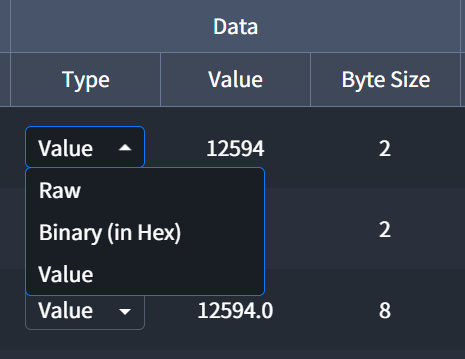

# Data Type
`Tag`, `Call`, `Action` 테이블의 **Data 컬럼**에서는 수집 또는 생성된 데이터를 확인할 수 있습니다.  

| Data Type | Description |
| :-: | :- |
| Raw | 수집 또는 생성된 시점의 원본 데이터 입니다. |
| Hex (in Hex) | Value Type이 적용된 데이터를 Hex 형태로 변환한 데이터 입니다. |
| Value | Raw 데이터에 [Value Type](./valueType)이 적용된 데이터 입니다. |
