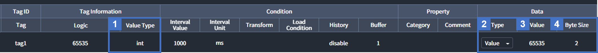

# Value Type
Interactor에서 수집 또는 생성된 데이터는 **15개의 값 타입(Value Type)** 을 적용하여 Value Type의 값을 가질 수 있습니다.

| Data Type | Description |
| :- | :- |
| (1) Value Type | Tag의 Raw 데이터에 적용할 Value Type |
| (2) Data / Type | `Raw`, `Binary(in Hex)` 그리고 `Value` 중 (3) Data / Value 에 표시할 타입  |
| (3) Data / Value | (1) Value Type 과 (2) Data / Type 의 Type이 반영된 Tag의 값 |
| (4) Byte Size | `Raw` 값의 Byte 사이즈 |

::: tip 
NOTICE

**1️⃣ Value Type**으로 적용된 값은 **2️⃣ Data Type**이 `Value`일 때, **3️⃣ Data Value**에 출력됩니다.
:::

## 1. Signed Integer
**부호가 있는 정수형** 타입입니다.

## 2. Unsigned Integer
**부호가 없는 정수형** 타입입니다.

## 3. Float
부동 소수점 숫자 형식으로 **실수 타입**입니다. 
`32비트 단정밀도(Single-precision)`와 `64비트 배정밀도(Double-precision)`을 지원합니다.  

::: tip 
NOTICE

- External Entity의 Tag에 Float를 사용할 때 데이터가 4바이트면 자동으로 단정밀도, 8바이트면 자동으로 배정밀도가 적용됩니다.  
- Internal Entity의 Tag에 Float를 사용하면 항상 배정밀도가 적용됩니다.  
:::

::: warning 
WARNING

대상 Tag의 값이 32비트(4바이트) 또는 64비트(8바이트)가 아니면 의도하지 않은 값이 출력될 수 있습니다.  
:::

### 단정밀도 (Float, IEEE754 Single precision 32-bit)
Tag의 값이 **F4바이트**인 경우 단정밀도가 사용됩니다. 예를 들어, Binary 값이 `0x3F00000`의 단정밀도 Decimal 값은 `0.5`입니다. `0x3F000000`의 값을 가지는 Tag에 Float를 적용하면 Data Value가 `0.5`로 출력됩니다.

<h6 class="h6-pt-0"> 자세한 내용은 <a href="https://www.binaryconvert.com/convert_float.html">https://www.binaryconvert.com/convert_float.html</a>를 참고 바랍니다.</h6>

### 배정밀도 (Double, IEEE754 Double precision 64-bit)
Tag의 값이 **8바이트**인 경우 배정밀도가 사용됩니다. 예를 들어, Binary 값이 `0x3FE0000000000000`의 단정밀도 Decimal 값은 `0.5`입니다. `0x3FE0000000000000`의 값을 가지는 Tag에 Float를 적용하면 Data Value가 `0.5`로 출력됩니다.  

<h6 class="h6-pt-0"> 자세한 내용은 <a href="https://www.binaryconvert.com/convert_double.html">https://www.binaryconvert.com/convert_double.html</a>를 참고 바랍니다.</h6>

## 4. Binary
데이터를 **8비트로 나누어 Hex 형태**로 표현합니다. 예를 들어, 8의 Binary는 `0x08`, 255의 Binary는 `0xFF`, 4095의 Binary는 `0x0FFF`입니다. 8비트로 단위로 값을 가지기 때문에 Byte size는 최소 2 이상, 항상 2의 배수입니다.

## 5. Boolean
**참과 거짓**을 나타내는 자료형 입니다. 0 이하의 값은 `False`, 0을 초과하는 값은 `True`입니다.

## 6. List
**순서가 있는** 데이터 구조이며 대괄호 **[ ]** 와 쉼표 **,** 를 사용하여 `[1, 2, 3, 4]`와 같이 표현합니다. 특정 순서의 데이터를 선택할때는 `[1, 2, 3, 4] |> Enum.at(0)` 와 같이 Elixir Syntax를 사용할 수 있습니다.

<h6 class="h6-pt-0"> 자세한 내용은 <a href="../elixirSyntax/elixirSyntax.html">Elixir Syntax</a>를 참고 바랍니다.</h6>

## 7. Object
**키(key)와 값(Value)** 의 데이터 구조이며, `%{"key" => "value"}`와 같이 값을 가지며 Elixir의 Map 자료구조의 형태입니다.
::: tip 
NOTICE

- Object Type의 데이터는 사용자의 가독성 위해 Value에는 JSON 형태로 표현합니다.
- 예시) 실제값: `%{"key" => "value"}`, 표시되는 값: `{"key": "value"}`
:::
<h6 class="h6-pt-0"> 자세한 내용은 <a href="../elixirSyntax/elixirSyntax.html">Elixir Syntax</a>를 참고 바랍니다.</h6>

## 8. String-Int
**""** 안의 문자열(String)이 정수인 경우 **부호를 가진 정수**로 표현합니다. 예를 들어, `"1"`은 `1`, `"123"`은 `123`, `"-123"`은 `-123`입니다. `"1A"` 와 같이 10진수가 아닌 문자가 포함된 경우는 `N/A`로 표시되며 값을 가지지 않습니다.  

## 9. String-Uint
**""** 안의 문자열(String)이 정수인 경우 **정수**로 표현합니다. 예를 들어, `"1"`은 `1`, `"123"`은 `123`입니다. `"-10"`와 같이 부호를 가진 정수나 `"1A"`와 같이 10진수가 아닌 문자가 포함된 경우는 `N/A`로 표시되며 값을 가지지 않습니다.  

## 10. String-Float
**""** 안의 문자열(String)이 실수인 경우 **실수**로 표현합니다. 예를 들어, `"1"`은 `1.0`, `"-1"`은 `-1.0`, `"1.23"`은 `1.23`입니다. `"1A"`와 같이 10진수가 아닌 문자가 포함된 경우는 `N/A`로 표시되며 값을 가지지 않습니다.

## 11. String-Ascii
**""** 안의 문자열(String)을 **문자열**로 표현합니다. 예를 들어, `"1"`은 `"1"`, `"Hi"`는 `"Hi"`, `"안녕!"`은 `"안녕!"`입니다. 일부 특수 문자의 경우 백슬러시`\`를 사용하여 특수문자임을 표시해야 사용할 수 있습니다.  

## 12. Hex
**""** 안의 문자열(String)이 16진수인 경우 **8비트 단위의 16진수**로 표현합니다. 예를 들어, `"1"`은 `0x01`, `"1A"`는 `0x1A`, `"123"`은 `0x0123`입니다. 8비트로 단위로 값을 가지기 때문에 Byte size는 **최소 2 이상, 항상 2의 배수**입니다.

## 13. Hex-Int
**""** 안의 문자열(String)이 16진수인 경우 **부호를 가지는 10진수**로 표현합니다. 예를 들어, `"1"`은 `1`, `"10"`은 `16`, `"FFFF"`는 `-1`, `"FF01"`은 `-255`입니다.

## 14. Hex-Uint
**""** 안의 문자열(String)이 16진수인 경우 **부호가 없는 10진수**로 표현합니다. 예를 들어, `"1"`은 `1`, `"10"`은 `16`, `"FFFF"`는 `65535`, `"FF01"`은 `65281`입니다.

## 15. Hex-Float
**""** 안의 문자열(String)이 16진수인 경우 **부호를 가지는 10진수**로 표햔합니다. 예를 들어, `"1"`은 `1.0`, `"10"`은 `16.0`, `"FFFF"`는 `-1.0`, `"FF01"`은 `-255.0`입니다. 이때 실수는 배정밀도의 8바이트로 표현되며, Value가 `-255.0`일 때 Binary는 `0xC06FE00000000000`입니다.  