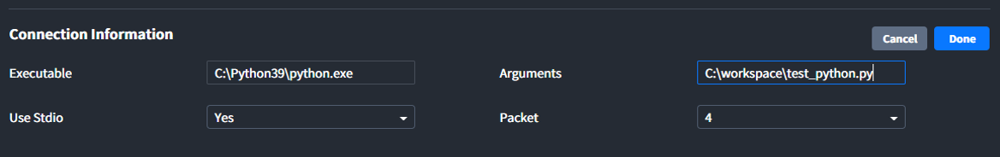

# Port
Interactor는 외부 프로그램과 연결을 위해 `Port` 기능을 제공합니다. `Port`는 표준 스트림을 이용하여 외부 프로그램과 데이터를 주고 받을 수 있습니다. `Connection Information`에서 외부 프로그램과의 연결을 위한 설정을 하고, `Tag Information`에서 전송할 데이터를 설정합니다. 외부 프로그램의 응답은 `Tag Information`에서 설정한 Value Type에 따라 값을 가지며 Data - Value에서 값을 확인하거나, 다른 Tag 사용 방법과 동일하게 Tag reference를 이용하여 다른 Entity에서 사용할 수 있습니다.

## Connection Information
Interactor와 외부 프로그램을 연결하기 위한 설정입니다.

### Executable

외부 프로그램을 실행하기 위해 실행 가능한 외부 프로그램을 입력합니다.

##### 예시1) 외부 프로그램 실행파일의 path 입력
``` bash
C:\Python39\python.exe
```


##### 예시2) 운영체제에 환경변수가 설정되어 있는 경우 path를 생략하고 실행파일만 입력 가능
``` bash
python
```


### Arguments
Executable에 입력된 실행파일에 필요한 Arguments를 입력합니다. 

###### 자세한 입력 방법은 **대상 실행파일의 Arguments 입력 방법**을 참고 바랍니다.

##### 예시1) Python의 Arguments
Executable에 `python.exe`가 입력된 경우 python.exe 실행에 필요한 Argument(.py의 경로) 입력
``` bash
C:\workspace\test_python.py
```


##### 예시2) Cmd의 Arguments
Executable에 `cmd.exe`가 입력된 경우 cmd.exe를 실행하기 위해 필요한 Argument 입력
``` bash
cmd.exe
```


::: tip <p class="custom-block-title">TIP</p>
cmd와 같이 Argument로 입출력 방향 지정(I/O Redirection)을 할 수 있을 때, file descriptors `2` 와  redirection opterator `>`를 사용하여 Port 실행시 발생하는 표준 오류를 문서로 출력하여 디버깅에 사용할 수 있습니다.
```
/c c:/test/service.py 2>test.txt
```
:::

### Use Stdio
Interactor와 외부프로그램의 데이터 송수신 방법을 선택합니다.
(현재 Yes 모드만 사용 가능합니다.)
- **Yes**: 표준 입력(stdin, file descriptors 0), 표준 출력(stdout, file descriptors 1) 사용
- **No**: File descriptors 3, file descriptors 4 사용

### Packet
송수신할 데이터의 Length를 실어 보낼 Header의 Byte 길이를 지정합니다. 설정한 Header를 통해 데이터의 Length를 확인하고, 그 Length만큼 데이터를 읽거나 씁니다(**N = Data Length**).  

| Packet | Header | 예) N = 255 | 예) N = 256 | 예) N = 16777216 |
| :-: | -:| -: | -: | -: |
| 0 | - | - | - | - |
| 1 | N | 255| - | - |
| 2 | 0&nbsp;&nbsp;&nbsp;&nbsp;N | 0&nbsp;&nbsp;&nbsp;&nbsp;255 | 1&nbsp;&nbsp;&nbsp;&nbsp;0 | -  |
| 4 | 0&nbsp;&nbsp;&nbsp;&nbsp;0&nbsp;&nbsp;&nbsp;&nbsp;0&nbsp;&nbsp;&nbsp;&nbsp;N | 0&nbsp;&nbsp;&nbsp;&nbsp;0&nbsp;&nbsp;&nbsp;&nbsp;0&nbsp;&nbsp;&nbsp;&nbsp;255 | 0&nbsp;&nbsp;&nbsp;&nbsp;0&nbsp;&nbsp;&nbsp;&nbsp;1&nbsp;&nbsp;&nbsp;&nbsp;0 | 1&nbsp;&nbsp;&nbsp;&nbsp;0&nbsp;&nbsp;&nbsp;&nbsp;0&nbsp;&nbsp;&nbsp;&nbsp;0 | 

##### 예시) Interactor로 `hello`를  보내는 경우(Elixir)
``` elixir
# Tag Info - Value Type: String-ASCII
# hello의 length: 5
# hello의 ASCII Code: 104, 101, 108, 108, 111

# Packet 0
<<104, 101, 108, 108, 111>>

# Packet 1 
<<5, 104, 101, 108, 108, 111>>

# Packet 2
<<0, 5, 104, 101, 108, 108, 111>>

# Packet 4
<<0, 0, 0, 5, 104, 101, 108, 108, 111>>
```

::: tip <p class="custom-block-title">NOTICE</p>
`<< >>`는 binary를 의미합니다. 자세한 내용은 [Elixir Syntax의 Binary](../elixir/binary.md)를 참고 바랍니다.
:::

## Tags
Tags에서 외부 프로그램으로 Read Request를 전송할 때 데이터를 설정하고, 응답을 확인할 수 있습니다.

### Tag Information
Procotol Builder에서 프로토콜 생성 시 입력한 Tag Information의 Key가 Tag Information 테이블의 헤더가 되고, Tag에 입력한 데이터가 외부 프로그램으로 전송됩니다.

### Data
외부 프로그램의 응답으로 JSON 데이터가 수신됩니다. 수신된 json 중 `value` key의 데이터가 Tag의 값이 됩니다.

###### 자세한 내용은 [Tags 페이지](../general/tags.md)를 참고 바랍니다.

## Actions
###### 자세한 내용은 [Actions 페이지](../general/actions.md)를 참고 바랍니다.

## Request Data & Response Data
아래 그림은 Port를 이용하여 외부 프로그램과 데이터를 주고 받을 때 데이터 구조와 69 바이트의 JSON 데이터 `{"id":784172,"data":{"tagInfo":{"msg":"hello"},"command":"read_tag"}}`가 어떻게 구성되는지 보여줍니다.


Length는 Data가 몇 바이트인지 알려주며, Length는 Communication Information에서 설정한 Packet 갯수의 바이트로 구성되어 있습니다. Data에는 JSON 구조의 ASCII 데이터가 Length 바이트로 구성되어 있습니다.


### Request Data
Interactor에서 외부 프로그램으로 데이터를 전송할 때 JSON 구조입니다.
- **id**: Request와 Response를 연결하기 위한 트렌잭션 아이디 (0과 1,000,000 사이의 임의의 정수)
- **data/tagInfo**: Tag Information에서 설정된 Tag의 Key와 사용자가 입력한 Value
- **data/command**: Tag 를 이용한 Read reqest (read_tag)와 Action을 이용한 Write request(write_tag)

##### 예시) Request Data
``` json
{
  "id": 309669,
  "data": {
    "tagInfo": { 
      "msg": "hello" // custom protocl을 통해 만든 tag information
    },
    "command": "read_tag"
  }
}
```

### Response Data
외부 프로그램에서 Interactor의 요청에 대해 응답할 때 사용자가 작성해야 하는 JSON 구조입니다.
- **id**: 트렌잭션 아이디 (Request에서 받은 id 사용)
- **value**: Data / Value에 표시되며 Tag의 값이 되는 응답 데이터

##### 예시) Response Data Structure
``` json
{
  "id": 309669,
  "value": "hello"
}
```

## Extenal Program Code Example
### Elixir로 작성된 외부 프로그램
##### 예시) 사용자가 입력한 "msg"의 value 앞에 "Hello "를 붙여서 응답하는 코드
- Elixir Code
``` elixir
defmodule PortWithElixir do
  @packet_byte 4
  @packet_bit 8

  def main(_) do
    communication_loop()
  end

  def communication_loop() do
    # Packet_Byte만큼 데이터를 읽어 Interactor에서 보내는 데이터의 길이를 얻어옴
    length = IO.read(:stdio, @packet_byte) |> :binary.decode_unsigned
    # 데이터의 길이만큼 잘라서 데이터를 읽음
    data = IO.read(:stdio, length)
    # Interactor로 보낼 데이터를 가공 후 Response
    data |> decode_json |> encode_json |> parse_binary |> send_data
    # Loop
    communication_loop()
  end

  def decode_json(data) do
    # json 형식의 파일을 Map 형태로 decode
    data |> Poison.decode!
  end

  def encode_json(data_from_interactor) do
    # Tag Information의 'msg'의 값 앞에 "Hello"를 추가해서 String 형태로 encode
    msg = data_from_interactor["data"]["tagInfo"]["msg"]
    data_from_interactor |> Map.delete("data") |> Map.put("value",  "Hello " <> msg) |> Poison.encode!
  end

  def parse_binary(data_to_interactor) do
    # (Interactor로 보낼 데이터의 길이 + 데이터)를 binary type으로 변환
    length = data_to_interactor |> String.length
    <<length::@packet_byte * @packet_bit>> <> data_to_interactor
  end

  def send_data(data_to_interactor_binary) do
    # Interactor로 데이터 송신
    IO.write(:stdio, data_to_interactor_binary)
  end

end
```
- Tag Information의 Key"msg"에 LS를 입력한 경우 "Hello LS"를 응답