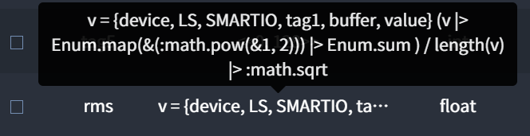

# Etc
이 페이지는 Interactor에서 유용하게 사용할 수 있는 Syntax를 설명합니다.

## RMS
- Buffer를 사용하고 있는 Tag의 RMS 계산입니다.  
- Virtual의 Logic에 아래와 같이 사용할 수 있으며, RMS 계산을 위한 타겟 Tag는 v에 입력합니다. 이때 Tag의 Value type은 Signed Integer, Unsigned Integer, Float 중 하나가 되어야 합니다.  
``` elixir
v = {device, LS, SMARTIO, tag1, buffer, value}
(v |> Enum.map(&(:math.pow(&1, 2))) |> Enum.sum ) / length(v) |> :math.sqrt
```
##### 예시) Virtual Tag Logic에서 RMS 사용  
