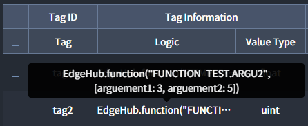

# Function
Function에서 Elixir code로 구성된 함수를 정의하고 다른 Entity에서 사용할 수 있습니다. 자주 사용하거나, 여러 Tag에 사용된 내용을 한번에 수정할 필요가 있을 때 효율적으로 사용할 수 있습니다.

::: tip <p class="custom-block-title">NOTICE</p>
#### Function 사용 가능 항목
* `Tags` > `Tag Information` > `Logic`
* `Tags` > `Tag Information` > `Transform`
* `Actions` > `Action Information` > `Value`
:::

## Tags
함수를 설정합니다.

### Tag Information
| Key | Description | Required |
| :- | :- | :-: |
| _Logic_ | Elixir code로 함수 작성 | * |
| _Value Type_ | 함수의 결과 Type | * |


## Logic 작성 규칙
* Interactor에서 사용 가능한 모든 Elixir Syntax를 사용할 수 있습니다.
* `Tag reference`를 사용하여 다른 Tag의 값을 가지고 올 수 없습니다.
* Parameter는 알파벳 소문자로 시작하는 연속된 문자열의 형태로 알파벳, 숫자 그리고 Underscore(_)를 사용할 수 있습니다.
* Parameter 최소 1개 이상 필수로 사용해야 하며, 개수의 제한은 없습니다.
* `Logic`의 결과는 `Value Type`이 형태의 값으로 표현될 수 있어야 합니다.

## Function 사용 방법
작성된 `Function`은 다른 `Entity`에서 아래와 같이 사용할 수 있습니다.
* 대소문자를 구분합니다.
* ARGUMENT_VALUE 앞에는 반드시 띄워쓰기가 필요합니다.
```
EdgeHub.function("FUNCTION_ENTITY_NAME.FUNCTION_TAG_ID", [ARGUMENT_1_KEY: ARGUMENT_1_VALUE, ..., ARGUMENT_N_KEY: ARGUMENT_N_VALUE])
```
| Key | Description | Required |
| :- | :- | :-: |
| _FUNCTION_ENTITY_NAME_ | Function Entity 이름 | * |
| _FUNCTION_TAG_ID_ | Function Tag ID | * |
| _ARGUMENT_1_KEY_ | FUNCTION에서 정의된 Parameter1 이름 | * |
| _ARGUMENT_1_VALUE_ | FUNCTION에서 정의된 Parameter1에 사용될 값 | * |

## Function 작성과 사용 예시
##### 예시1) 온도 섭씨(℃)를 화씨(°F)로 변환
`Function Entity` "TEMPERATURE"에 Tag ID를 "fahrenheit"로 생성하고, 섭씨를 화씨로 변경하는 `Function` 작성 예시는 아래와 같습니다.  
```
celsius* 9 / 5 + 32
```


`Function` 사용 예시는 아래와 같습니다.
```
EdgeHub.function("TEMPERATURE.fahrenheit", [celsius: 34])
```


##### 예시2) Argument 2개 사용 예시
Argument 2개를 사용한 `Function` 작성 예시는 아래와 같습니다.
```
arguement1 + arguement2
```


`Function` 사용 예시는 아래와 같습니다.
```
EdgeHub.function("FUNCTION_TEST.ARGU2", [arguement1: 3, arguement2: 5])
```
