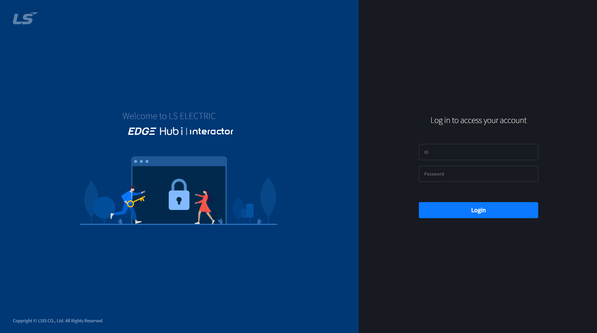
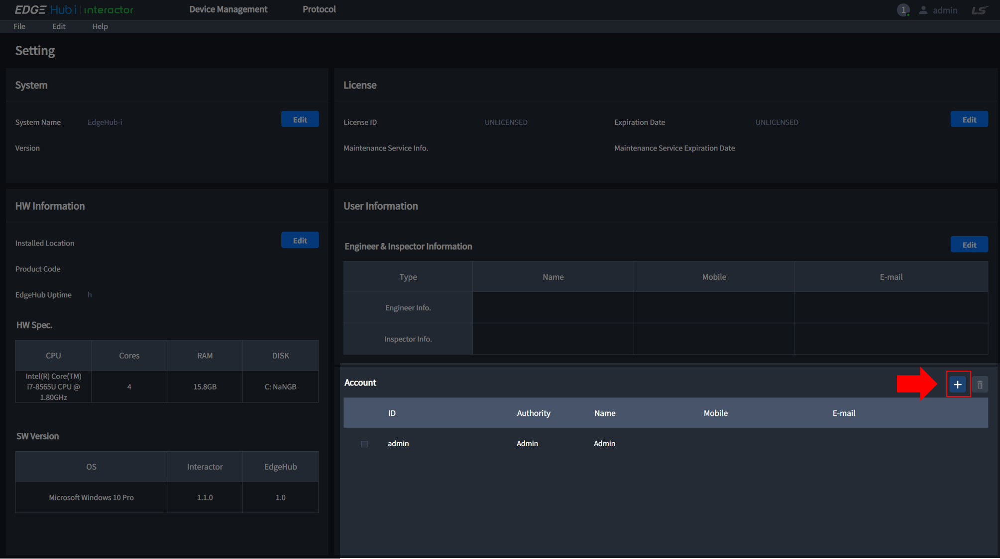

# Account
이 페이지는 Admin Account 생성, Login 및 Account 추가를 설명합니다.

Table of Contents

[[toc]]

## Admin Account
EdgeHub-i 를 설치하고 http://localhost:1290에 처음 접속하면 아래와 같은 Admin account 생성 화면을 확인할 수 있습니다.  

::: warning 
WARNING

Admin account는 추가 생성 또는 변경이 불가능 합니다.  
계정 또는 비밀번호 분실 시 EdgeHub-i를 다시 설치해야 합니다.
:::

## Login
Admin account이 있을 떄 EdgeHub-i web에 접속하면 아래와 같은 로그인 화면을 확인할 수 있습니다.  
Admin account 또는 Admin account으로 접속 후 생성한 account을 이용하여 로그인 할 수 있습니다.  
  

## Account 추가
Admin account으로 접속 후 화면 우측 상단의 관리자 아이디 클릭 / Setting 클릭으로 접속할 수 있는 Setting 페이지에서 Account를 생성할 수 있습니다.  
  
  

::: tip 
NOTICE

Account에 대한 Authority는 다음과 같습니다. 
| Authority | Description |
| :-: |:- |
| __Admin__ | Interactor의 모든 기능 사용 가능 |
| __RWC__ | Account 생성을 제외한 모든 기능 사용 가능(Read, Write, Commit)| 
| __RW__ | Read와 Write 사용 가능 |
| __R__ | Read 사용 가능 |
:::
