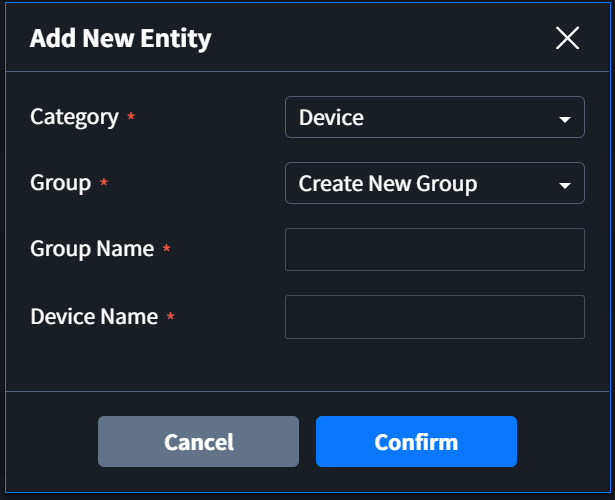

# Entity

이 페이지는 Edgegub-i | Interactor web (이하 Interactor)에서 Entity 등록 방법과, Entity 별 페이지에 대해서 간단하게 설명합니다.

Interactor에 등록되는 Entity는 크게 두 가지로 분류할 수 있습니다.
* External Entity: 외부 디바이스 또는 SW와 연결되는 Entity (Device, Server, Database)
* Internal Entity: 데이터 수집 후 사용자가 원하는 추가적인 데이터 가공을 위해 Interactor에서 제공하는 기능으로 구분되는 Entity (Virtual, Sync, Function)

## Entity 추가
화면 왼쪽의 Navigation에서 Entity를 추가하거나 삭제할 수 있습니다.  

`+` 버튼을 클릭하면 아래와 같은 Modal 창이 나타납니다. Device Entity는 사용자의 편의성을 위해서 Group으로 구분하여 추가할 수 있습니다. 다른 Entity는 Group 없이 Category에 추가됩니다.  

::: tip 입력 조건
Group 과 Entity 생성 시 영문자, 한글, 숫자 그리고 일부 특수문자를 사용할 수 있습니다.  
(사용할 수 없는 특수 문자 - comma(,), period mark(.), space( ) 그리고  Backslach(\\))
:::

## Device
Device는 PLC와 같이 데이터 수집의 대상이 되는 기기 입니다.   
Group 이름 또는 Device 이름을 클릭하면 해당 페이지가 출력됩니다.  

### Device Information Page
데이터 수집의 대상이 되는 기기와 통싵을 위한 프로토콜을 설정하고, 연결하기 위한 정보를 설정하는 페이지 입니다.

#### 1. Device Name
사용자가 설정한 Device 이름입니다.

#### 2. Device ON / OFF Button
모든 Device와 Edgehub 통신을 시작하거나 중지하는 버튼입니다. 
Inactive는 통신이 중지되어 있는 상태이며, Active는 통신 중 또는 통신 시도 중인 상태 입니다.  

#### 3. Device Detail
Device와 관련된 정보를 사용자가 입력하고 확인할 수 있습니다.

#### 4. Service
Device와 통신을 위한 프로토콜을 선택합니다.  
7가지의 built-in 프로토콜 또는 사용자가 직접 작성한 프로토콜을 선택할 수 있습니다. (2021년 4월 기준)  

##### Built-in Protocol
* OPC UA
* Modbus TCP
* Modbus RTU
* MELSEC SERIAL
* MELSEC ETHERNET
* FENET
* CNET

#### 5. Connectoin Info
선택한 Protocol 사용에 필요한 접속 정보를 입력합니다.   
Protocol마다 필요한 정보가 다르며, 자세한 내용은 Protocol 설명 페이지를 참고 바랍니다.  

### Tags Page
기기의 데이터를 수집하기 위한 세부 정보를 입력하는 페이지 입니다.  
수집된 데이터는 Tag라는 이름으로 정의하여 사용합니다.

#### 1. Tags Table
Tags 테이블에서는 Device에서 데이터를 수집하고 Tag로 저장하기 위해 필요한 정보를 입력합니다.

##### [데이터 수집을 위한 설정]
##### Tag ID
* Tag: 수집된 데이터를 분류하고 사용하기 위해 Edgehub에서 부여하는 이름입니다.
##### Tag Info
* Tag info: 수집을 위해 필요한 Device와 관련된 정보를 설정합니다. Protocol에 따라 필요한 정보가 다릅니다.
##### Condition
* Interval: Tag 마다 설정할 수 있는 수집 주기입니다. 값인 Value와 단위인 Unit을 설정하여 수집주기를 설정할 수 있습니다.
* Transform: 수집된 데이터를 Tag에 저장하기 전 pre-processing을 위해 사용합니다.
* Load condition: 데이터를 수집하여 Edgehub inner database에 저장하는 기능을 사용할 때 저장하는 조건입니다.
입력 조건을 만족하지 않으면 저장하지 않고, 입력 조건이 없으면 항상 저장합니다.  
(Inner database를 사용할 때)
* History: Edgehub inner database에 저장 기능 사용 여부를 결정하는 버튼입니다. Inner database가 설정되어 있고, Enable을 선택하면 저장기능을 사용하고, Inner database가 설정되어 있지 않거나 Disable를 선택하면 저장기능을 사용하지 않습니다.
* Buffer: Tag 마다 저장할 수 있는 개수를 설정합니다. 최대 1000까지 입력 가능합니다.

##### [사용자 편의를 위한 설정]
##### Property
* Category: Tag의 Category를 구분하기 위한 정보를 입력합니다. 사용자가 필요한 경우 입력합니다.
* Comment: Tag와 관련된 정보를 입력합니다. 사용자가 필요한 경우 입력합니다.

##### [설정 완료 후 수집된 데이터]
##### Data
* Type: Raw, Binary, Value의 3가지 타잎중에 선택할 수 있습니다. Raw는 수집된 실제 데이터를 출력하고, Binary는 이진데이터를 16진수로 변환하여 값을 출력하고, Value는 Tag Information에서 선택한 Value Type에 따라 변환된 값을 출력합니다.
* Value: 수집된 Tag의 value 입니다. 수집주기와 상관없이 1초마다 값이 갱신됩니다.
* Byte Size: 데이터의 크기를 Byte 단위로 나타냅니다.

### Actions Page
Actions Table에서는 Tag에서 설정한 데이터 수집에 성공했을 때 필요한 추가적인 동작을 설정합니다.

#### 1. Actions Table
Actions 테이블에서는 해당 Entity의 Tags 테이블에 등록된 Tag를 대상으로 추가적인 동작을 설정합니다.

##### Action ID
* Tag: 어떤 Tag 수집에 성공했을 때 Action을 수행할지 대상을 선택합니다.
* Condition: Action을 수행하기 위한 추가적인 조건을 입력합니다.
* Action: 수행할 동작을 선택합니다.
  1. Tag: Action Information에 설정되는 Tag에 Value의 값을 전송합니다.
  2. Call: ACtion Information에 설정되는 Call을 한 번 실행합니다.
  3. Event: Interactor의 내부 데이터베이스에 Event를 기록합니다. (내부 데이터베이스 설정 시 동작)
  4. Log: System Log에 값을 출력하고, 지정된 파일에 기록합니다.

##### Action Information
* Category ~ Call / Tag: Tag 또는 Call을 선택한 경우 대상을 선택합니다.
* Value: Tag, Event, Log를 선택한 경우 사용할 값을 입력합니다.

##### Data
* Type: Raw, Binary, Value의 3가지 타잎중에 선택할 수 있습니다.
* Value: 실행되는 Call의 value 입니다.
* Byte Size: 데이터의 크기를 Byte 단위로 나타냅니다.

## Server
Server는 Interactor에서 Server 역할을 하여 외부 Client의 요청에 응답할 수 있는 Entity 입니다.

## Database
Database는 Interactor와 연결되는 Database

## Virtual

## Sync

## Function