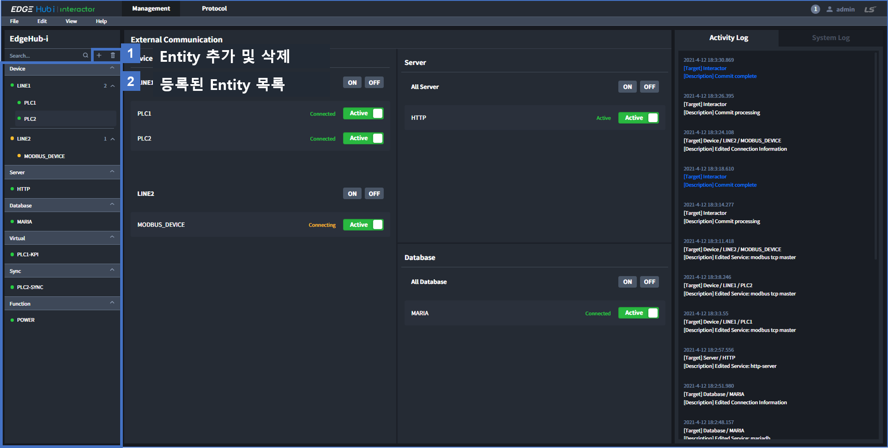
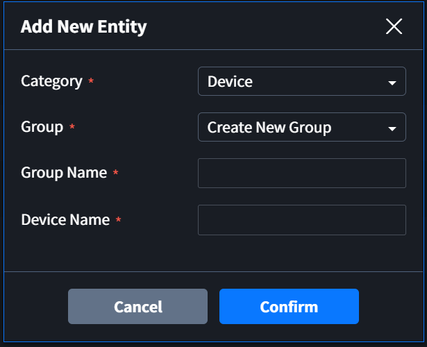

# Entity
이 페이지는 Edgegub-i | Interactor web (이하 Interactor)에서 Entity 등록 방법과, Entity 사용 방법을 간단하게 설명합니다.

Table of Contents

[[toc]]

Interactor에 등록되는 Entity는 크게 두 가지로 분류할 수 있습니다.
* External Entity: 외부 디바이스 또는 SW와 연결되는 Entity (Device, Server, Database)
* Internal Entity: 데이터 수집 후 사용자가 원하는 추가적인 데이터 가공을 위해 Interactor에서 제공하는 기능으로 구분되는 Entity (Virtual, Sync, Function)

## Entity 추가
화면 왼쪽의 Navigation에서 Entity를 추가하거나 삭제할 수 있습니다.  

`+` 버튼을 클릭하면 아래와 같은 Modal 창이 나타납니다. Device Entity는 사용자의 편의성을 위해서 Group으로 구분하여 추가할 수 있습니다. 다른 Entity는 Group 없이 Category에 추가됩니다.  

::: tip 입력 조건
Group 과 Entity 생성 시 영문자, 한글, 숫자 그리고 일부 특수문자를 사용할 수 있습니다.  
(사용할 수 없는 특수 문자 - comma(,), period mark(.), space( ) 그리고  Backslach(\\))
:::

## Device
Device는 PLC(Programmable Logic Controller)같이 데이터를 가지고 있으며, 통신으로 데이터를 요청하여 응답받을 수 있는 기기들이 대상으로 하는 Entity 입니다.  
Interactor에서는 아래 7가지 프로토콜을 사용하는 기기들을 연결하여 데이터를 쓰거나(Action), 수집(Tag) 할 수 있습니다.  
### Device 프로토콜 목록
* OPC UA
* Modbus TCP
* Modbus RTU
* MELSEC SERIAL
* MELSEC ETHERNET
* FENET
* CNET

## Server
Server는 Interactor에서 Server 역할을 하여 외부 Client의 요청에 응답할 수 있는 Entity 입니다.  
Server는 Tag를 사용하는 타입과 정의된 API만 사용할 수 있는 타입의 두 종류가 있습니다.

### Tag를 사용하는 Server 목록
Device, Database, Virtual, Sync에서 생성한 Tag의 데이터를 전달할 수 있습니다.
* OPC UA
* Modbus TCP
* HTTPS
* HTTP

### API를 사용하는 Server
Orchestrator 와 Insight 같은 EdgeHub 제품군을 위한 Server 입니다. 
Tag 설정 없이 정의된 API를 사용하여 Interactor의 데이터를 수집하거나 제어할 수 있습니다.  
* API SERVER

## Database
Interactor는 Database와 연결하여 데이터를 쓰거나(Action, Call), 수집(Tag, Call) 할 수 있습니다. 
MariaDB는 EdgeHub에서 정의한 schema를 사용하여 Interactor의 데이터를 저장할 수 있습니다.

### Database 목록
* MSSQL
* MariaDB
* MariaDB EdgeHub (내부 데이터베이스 사용을 위한 서비스)
* InfluxDB
* Machbase (개발 중, 21.06 완료 예정)

## Virtual
Virtual은 데이터를 생성하거나 다른 Tag의 데이터를 가공하기 위해서 사용하는 Entity 입니다.  
Tag Information에 Logic에 데이터를 입력하여 사용자가 원하는 형태의 값을 만들 수 있습니다.   
데이터 직접 입력, 사칙연산 또는 Tag의 값을 이용하여(Tag reference) 데이터를 쉽게 가공하거나, Elixir 언어를 직접 사용하여 사용자가 원하는 어떠한 형태로도 가공할 수 있습니다.

## Sync
Sync는 수집된 Tag의 데이터 수집시간을 동기하여 Tag로 출력하거나 CSV 파일로 출력하기 위해 사용하는 Entity 입니다.

## Function
반복적으로 사용되는 연산을 편하게 사용하기 위해 Function에 정의하여 사용합니다.  
Transform, Logic, Value에서 Function을 사용할 수 있습니다.  