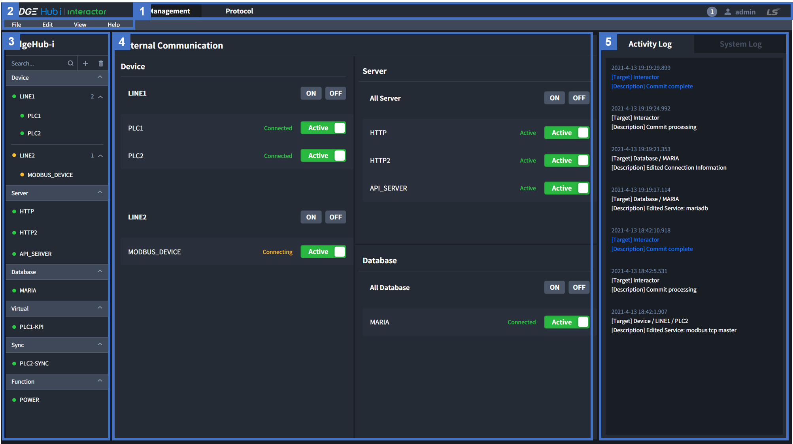
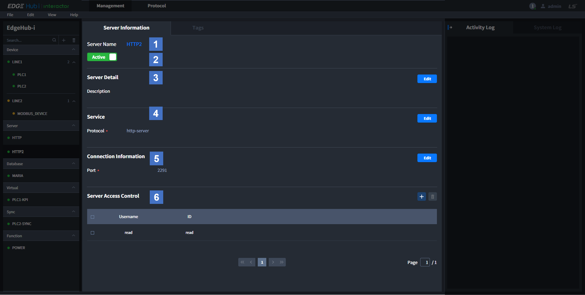
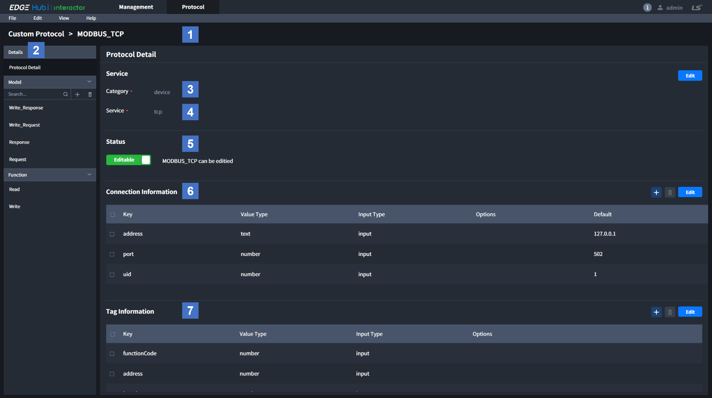

# Web Page 
이 페이지는 Edgegub-i | Interactor Web Application(이하 Interactor)의 사용 방법을 설명합니다.

Table of Contents

[[toc]]

## Web Structure  
Web 전체적인 구조에 대해서 설명합니다. 아래는 Login 후 출력되는 화면입니다.   

| No | Item | Description |
| :-: |:--:|:- |
| 1 | _Top Navigation Bar (Main)_ | Management와 Protocol의 페이지이동, Online User 정보 그리고 제품 정보를 확인하기 위한 버튼이 있습니다.<ul><li>Management: 데이터 수집과 관련된 모든 설정을 제공하는 페이지</li><li>Protocol: 새로운 프로토콜을 추가할 수 있는 페이지</li><li>Online User: Commit, Edit 정보 및 접속중인 유저 확인 기능</li><li>Setting: System, License, HW, SW Information 정보 출력 및 Account 관리를 할 수 있는 페이지</li></ul> |
| 2 | _Top Navigation Bar (Sub)_ | File 가져오기 내보내기, Commit 과 Clear, View 모드 전환 그리고 사용 설명서 출력 버튼이 있습니다.<ul><li>File: 설정한 데이터를 Excel과 .edgehub 파일로 내보내거나 가져오기 기능</li><li>Edit: Web에서 설정한 데이터를 수행하기 위한 Commit과 설정 데이터 초기화를 위한 Clear</li><li>View: 추가/수정/삭제 등의 기능을 사용할 수 있는 Edit 모드와 읽기만 가능한 Read 모드 변환</li><li>Help: 온라인 또는 오프라인 사용 설명서</li></ul> |
| 3 | _Left Navigation Bar_ | Management 페이지 사용을 위해 Entity 추가/삭제, Entity 상태정보, Entity 페이지 이동을 위한 버튼이 있습니다. |
| 4 | _Content_ | Top 또는 Left Navigation에서 선택에 따라 내용이 변경되는 메인 화면 입니다. |
| 5 | _Log_ | Web 사용 기록이 출력되는 Activity Log와 시스템 정보가 출력되는 System Log 화면입니다. External Communication 페이지를 제외한 Management 페이지에서는 Log를 접을 수 있습니다.<ul><li>Activity Log: 휘발성. 새로고침 시 삭제</li><li>System Log: Backend에서 수행중인 시스템의 로그. 30초 간격으로 갱신</li></ul> |

## Setting
제품 정보, 하드웨어 정보 및 사용자 정보를 설정하거나 확인하는 페이지 입니다.  
Top Navigation의 왼쪽에 출력되는 Account ID를 클릭하여, 나오는 메뉴에서 Setting 버튼을 클릭하면 해당 페이지로 이동합니다.

| No | Card | Description |
| :-: |:--:|:- |
| 1 | _System_ | 사용자가 입력하는 시스템 정보입니다. System Name의 EdgeHub-i로 초기값이 설정되어 있으며, 설정된 값은 Management의 Left Navigation에 출력 됩니다. |
| 2 | _License_ | Interactor에서 제공하는 License, Expiration Date 정보 입니다. Maintenance Service Information, Maintenance Service Expiration Date는 필요한 경우 사용자가 직접 입력하여 사용합니다.|
| 3 | _HW Information_ | Interactor가 설치된 HW와 SW에 대한 전반적인 정보를 제공합니다. Installed Location과 Production Code는 필요한 경우 사용자가 직접 입력하여 사용합니다.|
| 4 | _Engineer & Inspector Information_|Interactor를 사용하는 관리자 정보입니다. 필요한 경우 사용자가 직접 입력하여 사용합니다.|
| 5 | _Account_| Login에 사용되는 계정 정보입니다. `+` 버튼을 클릭하여 계정을 추가할 수 있습니다. 자세한 내용은 Account 페이지를 참고해 주세요.|

## Group
Device Entity의 Group 정보를 출력하는 페이지 입니다.  
Management 페이지에서 Left Navitagion의 Group을 클릭하면 해당 페이지로 이동합니다.

| No | Item | Description |
| :-: |:--:|:- |
| 1 | _Group Name_ | Entity 생성 시 입력한 Group 이름 입니다. |
| 2 | _Group ON / OFF Button_ | Group에 속한 모든 Device가 Interactor와 통신을 시작 또는 중지하기 위한 버튼 입니다. ON 버튼 클릭 시 통신이 중지되어 있는 Device와 통신을 시작하며, OFF 버튼 클릭 시 모든 Device와의 통신을 중지합니다. 버튼은 Device들의 통신 상태를 나타내지 않습니다.  |
| 3 | _Group Tag Count_ | Group에 속한 모든 Device에 등록된 Tag의 전체 숫자를 출력합니다. |
| 4 | _Group Description_ | Group의 세부 정보를 입력할 수 있습니다. |
| 5 | _Device Name_ | Entity 생성 시 입력한 Device 이름입니다. |
| 6 | _Device Protocol_ | Device entity에서 선택된 통신 프로토콜 입니다. |
| 7 | _Device Tag Count_ | Device에 등록된 Tag의 숫자를 출력합니다. |
| 8 | _Device Descriptio_ | Device Information에서 등록된 Device의 세부정보 입니다. |

## Entity Information
Entity에 적용되는 공통적인 설정 페이지 입니다.  
Management 페이지의 Left Navigation에서 Entity 클릭 후 Content 화면에서 Information 탭을 클릭하면 해당 Content가 출력됩니다.

| No | Item | Description |
| :-: |:--:|:- |
| 1 | _Name_ | Entity 생성 시 사용자가 입력한 이름입니다. |
| 2 | _Entity ON / OFF Button_ | Entity와 Edgehub의 통신을 시작하거나 중지하는 버튼입니다. Inactive는 통신이 중지되어 있는 상태이며, Active는 통신 중 또는 통신 시도 중인 상태 입니다. |
| 3 | _Detail_ | Entity 관련된 정보를 사용자가 입력하고 확인할 수 있습니다. |
| 4 | _Service_ | Entity와 통신을 위한 프로토콜을 선택합니다. 카테고리 마다 다른 프로토콜을 제공합니다. |
| 5 | _Connectoin Info_ | 선택한 Protocol 사용할 때 필요한 공통적인 정보를 설정하기 위해 사용합니다. Protocol마다 필요한 설정 항목이 다릅니다. |
| 6 | _Server Access Control_ | 외부 Client에서 Interactor로 데이터를 요청할 때 아이디와 패스워드 사용하기 위해 사용합니다. Server Entity에서만 사용하는 기능입니다. |

## Entity Tags
Tag를 생성할 수 있는 Entity에서 제공되는 페이지 입니다.  
External Entity의 데이터 수집 또는 Internal Entity의 데이터 생성을 위한 세부 설정 및 수집된 값을 확인할 수 있는 페이지 입니다.
Interactor에서는 값을 가지는 데이터의 구분을 위해 Tag ID를 설정합니다.  
Tags 페이지는 Category 와 Protocol에 따라 사용되는 column이 다릅니다.  
Management 페이지의 Left Navigation에서 Entity 클릭 후 Content 화면에서 Tag 탭을 클릭하면 해당 Content가 출력 됩니다.

| No | Item | Description |
| :-: |:--:|:- |
| 1 | _Button_ | <ul><li>Add: 새로운 Tag를 생성합니다. 모든 필수 입력 항목이 입력되고, 입력항목의 입력 조건을 만족해야 등록이 됩니다.</li><li>Delete: 선택한 Tag를 삭제합니다. 테이블의 체크버튼으로 선택한 Tag들을 삭제 합니다.</li><li>Duplicate: 선택한 Tag를 복제합니다. 새로운 Tag를 생성할 때 기존에 생성된 Tag의 값을 이용하여 빠르게 생성하기 위해 사용합니다.</li><li>Edit: 등록된 Tag를 수정합니다. 모든 필수 입력 항목이 입력되고, 입력항목의 입력 조건을 만족해야 수정됩니다.</li></ul> |
| 2 | _Tag ID_ | Interactor 내부 또는 외부 Client에서 Interactor의 데이터를 사용하기 위해 설정되는 이름입니다. 생성된 Tag 아이디는 수정할 수 없습니다. |
| 3 | _Tag Information_ | Tag 수집을 위해 Protocol 마다 다른 입력이 필요한 설정 정보입니다. Category 와 Protocol에 따라 사용되는 column이 다릅니다. |
| 4 | _Condition_ | Tag 수집을 위해 모든 Interactor의 공통적으로 사용하는 설정 정보입니다. 수집주기, 전처리, 내부 Database에 저장, 임시 저장 공간 크기를 설정합니다. |
| 5 | _Property_ | 사용자의 편의를 위해 Tag 분류, 세부 정보를 입력합니다. 사용자가 필요한 경우 입력하여 사용합니다. |
| 6 | _Data_ | 설정 정보가 Commit 되고 수집된 데이터를 확인할 수 있습니다. <ul><li>Type: Raw, Binary, Value의 3가지 타잎중에 선택할 수 있습니다. Raw는 수집된 실제 데이터를 출력하고, Binary는 이진데이터를 16진수로 변환하여 값을 출력하고, Value는 Tag Information에서 선택한 Value Type에 따라 변환된 값을 출력합니다.</li><li>Value: 수집된 Tag의 value 입니다. 수집주기와 상관없이 1초마다 값이 갱신됩니다.</li><li>Byte Size: 데이터의 크기를 Byte 단위로 나타냅니다</li></ul> |

## Entity Actions
Tag가 수집되었을 때 추가적인 동작을 위해 Action을 사용합니다.  
Action을 생성할 수 있는 Entity에서 제공되는 페이지 입니다.  
Management 페이지의 Left Navigation에서 Entity 클릭 후 Content 화면에서 Action 탭을 클릭하면 해당 Content가 출력 됩니다.

| No | Item | Description |
| :-: |:--:|:- |
| 1 | _Button_ | Tags 의 Button과 동일합니다. |
| 2 | _Action ID_ | 어떤 동작을 수행할 것인지 설정합니다.<ul><li>Tag: 어떤 Tag가 수집되었을 때 Action을 수행할 지 대상을 선택합니다. 현재 선택한 Entity 내의 Tag만 선택 가능합니다.</li><li>Condition: Tag가 수집되었을 때 추가적인 수행 조건을 설정하기 원하는 경우 입력합니다.</li><li>Action: 어떤 동작을 수행할 지 선택합니다.</li></ul> |
| 3 | _Action Information_ | Action을 실행하기 위한 대상 또는 값을 입력합니다. Tag 또는 Call을 선택한 경우 대상을 입력합니다. Tag, Event 또는 Log를 선택한 경우 Value를 입력합니다. |
| 4 | _Data_ | Tags 의 Data와 동일합니다. |

## Entity Calls
Call은 Database에 사용자가 직접 Query를 작성하여 사용하기를 윈할 때 사용합니다.   
Call을 생성할 수 있는 Entity에서 제공되는 페이지 입니다.  
Management 페이지의 Left Navigation에서 Entity 클릭 후 Content 화면에서 Call 탭을 클릭하면 해당 Content가 출력 됩니다.

| No | Item | Description |
| :-: |:--:|:- |
| 1 | _Button_ | Tags 의 Button과 동일합니다. |
| 2 | _Call ID_ | Interactor 내부에서 Interactor의 데이터를 사용하기 위해 설정되는 이름입니다. 생성된 Call 아이디는 수정할 수 없습니다. |
| 3 | _Call Information_ | Query 입력을 위한 설정입니다. Protocol에 따라 사용되는 column이 다릅니다. |
| 4 | _Condition_ | Call 수집을 위해 모든 Interactor의 공통적으로 사용하는 설정 정보입니다. Call 수행 주기를 설정합니다. |
| 5 | _Property_ | Tags의 Property와 동일합니다. |
| 6 | _Data_ | Tags 의 Data와 동일합니다. |

## Protocol
Interactor의 External Entity에서 사용하는 프로토콜을 관리하는 페이지 입니다.  
각 프로토콜 선택 시 Protocol Builder 페이지로 이동합니다.  

| No | Item | Description |
| :-: |:--:|:- |
| 1 | _Button_ | <ul><li>Add: 새로운 프로토콜(이하 커스텀 프로토콜)을 생성합니다. 이미 등록된 프로토콜과 같은 이름은 사용할 수 없습니다.</li><li>Delete: 추가한 커스텀 프로토콜을 삭제합니다. Bulit-in 프로토콜은 삭제할 수 없습니다.</li><li>Export: 추가한 커스텀 프로토콜을 .json 파일로 출력합니다.</li><li>Import: 출력된 .json 파일의 커스텀 프로토콜을 Interactor에 가져옵니다.</li></ul> |
| 2 | _Device_ | Device Entity에서 사용할 수 있는 프로토콜 목록입니다. Built-in 프로토콜과 커스텀 프로토콜이 있습니다.<ul><li>Built-in: 프로토콜 이름만 표시 되어 있습니다.</li><li>커스텀 프로토콜 (Editable): 수정 가능한 커스텀 프로토콜 입니다. Device Entity에서는 선택할 수 없습니다.</li><li>커스텀 프로토콜 (Non-editable): Device Entity에서 선택할 수 있는 커스텀 프로토콜 입니다.</li></ul>Built-in 프로토콜 선택 시 Connection Information과 Tag Information을 확인할 수 있습니다. 사용자가 원하는 프로토콜(Custom Protocol)을 추기/삭제/내보내기/가져오기 할 수 있습니다. Top Navitagion에서 Protocol 버튼을 클릭하면 해당 페이지로 이동합니다. |
| 3 | _Server_ | Server Entity에서 사용할 수 있는 프로토콜 목록입니다. 모든 프로토콜이 Built-in이며 커스텀 프로토콜 추가는 불가능 합니다. |
| 4 | _Database_ | Database Entity에서 사용할 수 있는 프로토콜 목록입니다. 모든 프로토콜이 Built-in이며 커스텀 프로토콜 추가는 불가능 합니다. |

## Protocol Builder
Protocol 페이지의 Content 화면에서 프로토콜을 선택하면 해당 페이지로 이동합니다.
Built-in 프로토콜은 설정된 정보를 보여주고, 커스텀 프로토콜은 설정할 수 있습니다.  
아래에서는 커스텀 프로토콜을 대상으로 설명합니다.  

| No | Item | Description |
| :-: |:--:|:- |
| 1 | _Protocol Name_ | 선택한 프로토콜의 이름입니다. |
| 2 | _Left Navigation_ | Protocol Builder의 Left Navitagion은 Management와 구성이 다릅니다.<ul><li>Protocol Detail: 공통적인 정보를 설정하고 확인.</li><li>Model: 데이터 프레임을 구조를 설정. 추가, 삭제 가능.</li><li>Function: Model에 어떤 데이터를 사용할 것인지 설정. Read Function과 Write Function 고정.</li></ul> |
| 3 | _Category_ | 선택된 프로토콜의 카테고리 입니다. 커스텀 프로토콜은 Device만 선택 가능합니다. |
| 4 | _Service_ | 커스텀 프로토콜은 TCP, Serial, Port 중 어떠한 서비스를 사용할 지 선택합니다. 선택된 서비스에 따라 Connection Information, Tag Information의 초기값이 다르며, Port는 Model과 Function을 사용하지 않습니다. |
| 5 | _Status_ | 커스텀 프로토콜의 수정 / 사용 상태를 설정 합니다.<ul><li>Editable: 수정할 수 있지만 Device Entity에서는 선택할 수 없는 상태입니다.</li><li>Non-editable: Device Entity에서 선택할 수 있지만 수정할 수 없는 상태입니다. Device Entity에서 이미 사용중일때는 다시 Editable로 변경할 수 없습니다.</li></ul> |
| 6 | _Connection Information_ | 선택한 Protocol 사용할 때 필요한 공통적인 정보를 사용하기 위한 설정 테이블 입니다.<ul><li>Add: 새로운 설정을 추가합니다.</li><li>Delete: 선택된 설정을 삭제합니다. 만약 선택된 정보가 Function에서 사용되고 있는 경우, Function의 해당 Row는 초기화 됩니다.</li><li>Edit: 설정을 수정합니다. Key 및 초기값으로 설정된 일부 데이터는 수정이 불가능 합니다.</li></ul> |
| 7 | _Tag Incofmation_ | 데이터 수집을 위한 세부 설정 정보를 사용하기 위한 설정 테이블 입니다.<ul><li>Add: 새로운 설정을 추가합니다.</li><li>Delete: 선택된 설정을 삭제합니다. 만약 선택된 정보가 Function에서 사용되고 있는 경우, Function의 해당 Row는 초기화 됩니다.</li><li>Edit: 설정을 수정합니다. Key 및 초기값으로 설정된 일부 데이터는 수정이 불가능 합니다.</li></ul> |
