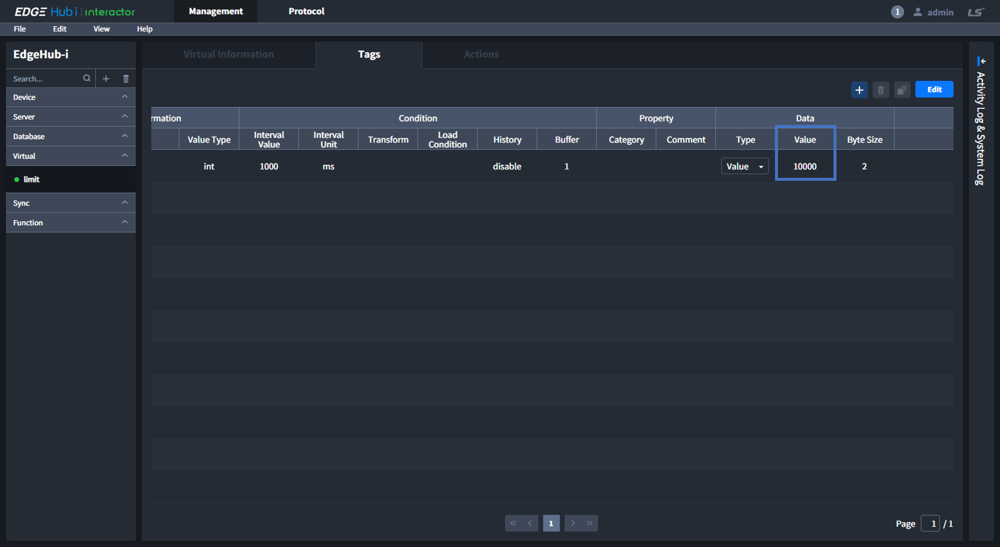
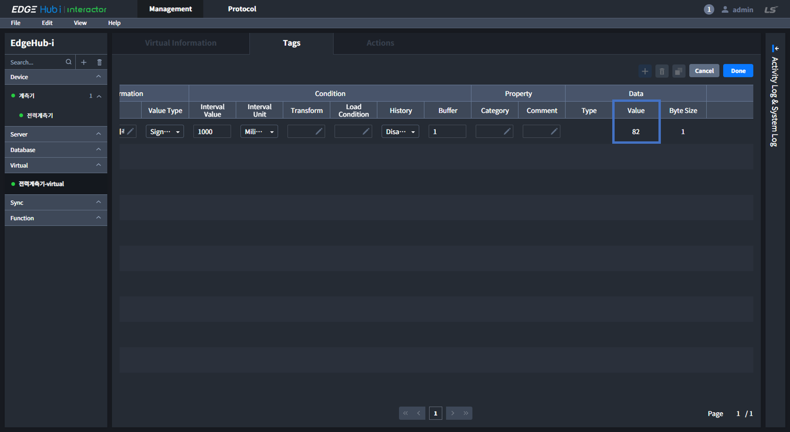

# Virtual
Virtual를 통해 다른 Entity의 Tag/Call을 불러와 가공하거나 [Elixir Syntax](../elixir/elixirSyntax.md)를 이용해 다른 Entity에서 사용할 수 있는 Tag를 생성할 수 있습니다.

::: tip 
NOTICE

Tag 생성방법은 External Entity(Device, Server, Database)와 대부분 동일하지만, Tag Information에서 실제 Entity의 정보가 아닌 `Logic`을 이용해 값을 입력해야 합니다.  
:::

Table of Contents

[[toc]]

## Virtual Tags
외부 디바이스와 통신이 아닌 Interactor 내부에서 값을 생성하고, 다른 Entity에서 사용할 수 있는 Tag를 만듭니다. 생성된 Virtual Tag는 다른 Entity에서 `{Tag reference}`로 사용할 수 있습니다.

::: tip 
NOTICE

`Tag Reference`는 `{entity_category, (group_name), entity_name, tag_ID}`로 구성되며, Category가 Device인 경우 `group_name`이 포함됩니다.
:::

#### :black_medium_square: Tag ID
- **Tag**: Virtual Tag를 식별할 수 있는 고유 ID입니다.

#### :black_medium_square: Tag Information
- **Logic**: [Elixir Syntax](../elixir/elixirSyntax.md)를 이용해 새로운 값을 생성하거나 다른 Entity의 Tag/Call 값을 reference하여 이를 가공할 수 있습니다.

  |NO|Description|
  |:-:|:-|
  |1 | SelectBox를 통해 다른 Entity의 Tag나 Call을 선택합니다. |
  |2 | 1번에서 선택한 Tag나 Call의 Reference를 생성하여 3번에 추가합니다. |
  |3 | Elixir문법을 이용하여 원하는 값을 생성하거나 가공할 수 있습니다.|

  ##### :mag_right: 예시1) 특정 상수를 입력하여 변수로 사용

  

  위와 같이 Virtual Tag를 생성하고 `Commit`할 경우 결과는 다음과 같습니다.
  

  ##### :mag_right: 예시2) 수집된 온도(℃)를 화씨(°F)로 변환하고 싶은 경우

  

    |NO|Description|
    |:-:|:-|
    |1 | Device > 계측기(Group) > 전력계측기(Entity) > 섭씨(Tag)의 **Tag Reference** |
    |2 | 섭씨(℃)를 화씨(°F)로 만들기 위한 공식 `화씨 = 섭씨 * 9 / 5 + 32`|

  
  위와 같이 Virtual Tag를 생성하고 `Commit`할 경우 결과는 다음과 같습니다.
  

- **Value Type**: Logic을 통해 가공한 데이터의 Value Type을 설정합니다. 

#### :black_medium_square: Condition
- **Interval Value**: Tag Value를 update할 **시간간격**을 설정합니다.
- **Interval Unit**: Interval Value에서 선택한 **시간단위**를 설정합니다.
- **Transform**: Tag Value를 Interactor로 가져오기 전 **전처리**할 수 있습니다. 
- **Load Condition**:
- **History**: 
- **Buffer**: Update 되기 전의 Value를 일시적으로 저장할 수 있습니다. 

#### :black_medium_square: Property
- **Category**: 
- **Comment**: Virtual Tag에 대한 설명 등과 같은 Meta data를 저장할 수 있습니다. 

#### :black_medium_square: Data
- **Type**: Display할 Value의 Type을 설정합니다.  
- **Value**: Tag의 Value 값을 Display합니다.
- **Byte Size**: Tag Value의 Byte 크기입니다.

## Virtual Actions
Tags Tab에서 생성한 Tag에 추가적인 Action을 설정할 수 있습니다. 설정된 Action은 해당 Tag가 실행되는 시점마다 발생합니다.

#### :black_medium_square: Action ID
- **Tag**:
- **Condition**:
- **Type**:

#### :black_medium_square: Action Information
- **Category**:
- **Group**:
- **Entity**:
- **Call/Tag**:
- **Value**:

#### :black_medium_square: Property
- **Comment**:

#### :black_medium_square: Data
- **Type**:
- **Value**:
- **Byte Size**:

Action에서 condition에 넣는 내용은 tag의 값과 함께 평가해서 참이면 action이 실행이 됩니다.  
Tag 값이 1이고, condition이  === 1 이면 , 1 === 1 이 참이되니까 실행이 되구요  
Tag 값이 2이고, condition이 === 1 이면, 1 === 2 는 거짓이니까 실행이 안됩니다.  
그래서 condition에는 tag 와 연결해서 썼을 때 true, false로 평가할 수 있는 어떠한 내용이 들어가도 됩니다.  
가능1)  === {device, GROUP, DEVICE, TAG}  
가능2)  +1 === {device, GROUP, DEVICE, TAG}  
가능3) > 100 && ({device, GROUP, DEVOCE, TAG} === 0)  
가능4) === if ( {device, aa, aaaa, tag2} < 5), do: {device, aa, aaaa, tag2}, else: 100  
4번도 if 문에서 결과가 상황에 따라 {device, aa, aaaa, tag2} 거나 100이 나오니, 그 결과와 tag의 value 값이 같으면 참이 되기때문에 사용할 수 있습니다.