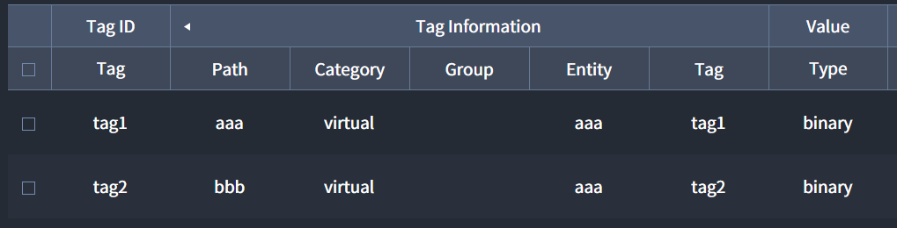
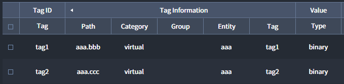

# HTTP & HTTPS
- HTTP 또는 HTTPS 클라이언트의 요청에 응답하는 서버를 만들 수 있습니다.  클라이언트의 데이터 수집을 위해 두 가지 방법을 제공하는데, 첫 번째는 Interactor가 기본적으로 제공하는 Path를 사용하는 방법이고, 두 번째는 사용자가 직접 만드는 Path를 사용하는 방법입니다.  
- HTTP는 파일 경로를 지정하여 웹 서버를 만들 수 있습니다.

## Connection Information
HTTP 또는 HTTPS 서버를 만들기 위해 필요한 데이터를 설정 합니다.

| Key | Description | Required |
| :- | :- | :-: |
| _Port_ | Server Port | * |
| _Web Server Path_ | Web server 대상 파일 경로 </br> Ex) c:/web_server/dist |  |


::: warning <p class="custom-block-title">WARNING</p>
Interactor의 Server에서 사용중인 `Port`를 입력하면 자동으로 사용 가능한 `Port` 번호로 변경됩니다. 단, Interactor가 아닌 다른 프로그램에서 사용하는 `Port` 번호는 확인하지 않습니다.
:::

## Server Access Control
엑세스 제어와 인증이 필요한 경우 **"Basic"** 인증을 설정합니다.

| Key | Description | Required |
| :- | :- | :-: |
| _Username_ | Interactor에서 구분하기 위한 사용자 이름 (Client에 전송되지 않음) | * |
| _ID_ | Basic 인증에 사용되는 아이디 | * |
| _Password_ | Basic 인증에 사용되는 패스워드 |


::: tip <p class="custom-block-title">NOTICE</p>
* 생성된 아이디가 없으면 Basic 인증 없이 HTTP 프로토콜을 사용할 수 있습니다.
* 생성된 아이디가 하나라도 있으면 타겟 서버(아이디가 있는 Port)의 모든 요청은 Basic 인증이 필요합니다.
* Client에서 Basic 인증 없이 인증이 필요한 HTTP 서버에 데이터를 요청하면, __"invalid autorization"__ 응답을 받습니다.
:::


## Tags
Interactor에서 제공하는 Path가 아닌사용자가 원하는 Path를 설정하여 데이터 수집을 원할 때 사용합니다.

### Tag Information
HTTP Client에서 요청할 대상 `Tag`와 `path`를 설정합니다. 

| Key | Description | Required |
| :- | :- | :-: |
| _Path_ | 사용자가 원하는 Path  | * |
| _Category_ | 응답의 대상이 되는 Category  | * |
| _Group_ | 응답의 대상이 되는 Device의 Group  |  |
| _Entity_ | 응답의 대상이 되는 Entity  | * |
| _Tag_ | 응답의 타겟이 되는 Tag  | * |

### Value
| Key | Description | 
| :- | :- |
| _Path_ | 타겟이 되는 Tag의 Value Type 자동 출력 |


### Path 입력 방법
URL에서 `http://Interactor IP 주소:HTTP 생성 시 입력한 Port/custom/` 뒤에 입력되는 Path입니다. Path는 영문자와 점(`.`) 을 사용하여 설정할 수 있습니다. 
- **단일 Path**: 점(`.`) 없이 영문자 또는 숫자를 입력하여 Path를 만들면, 하나의 Tag 값을 가르키는 Path가 됩니다.  
- **두 개 이상의 Tag 값을 가지는 Path**: 점(`.`)을 사용하여 Path를 만들면 두 개 이상의 Tag 값을 가지는 Path가 됩니다.    

## Client의 데이터 요청 URL
Client의 요청에 대해 JSON 형태로 데이터를 받을 수 있습니다.
### Interactor Path 를 사용한 Tag 데이터 요청
Interactor에서 제공하는 Path 구조를 사용하여 전체 데이터를 받거나 JSON 데이터의 Key를 Path에 사용하여 원하는 데이터를 받을 수 있습니다.
``` http
http://{Interactor IP 주소}:{HTTP 생성 시 입력한 Port}/data/tag/{path}
```

### Custom Path를 사용한 Tag 데이터 요청
Tags에서 사용자가 설정한 Path를 사용하여 지정한 Tag 데이터를 요청할 수 있습니다.
``` http
http://{Interactor IP 주소}:{HTTP 생성 시 입력한 Port}/{path}
```


## Client 요청에 대한 응답 데이터
응답 받은 데이터 중 Tag 데이터는 아래와 같이 구성되어 있습니다.
``` json
{
  "value_string": "0x64", // Value의 hex를 String으로 나타낸 값
  "value": "d", // Value type이 적용된 값
  "timestamp": 1620644793310, // Unix Timestamp
  "raw_string": "100", // raw를 String으로 나타낸 값
  "raw": 100, // raw 
  "binary_string": "0x64", // Binray의 hex를 String으로 나타낸 값
  "binary": "d" // Binary
}
```
::: tip  <p class="custom-block-title">NOTICE</p>
데이터 중 raw와 binary 출력에는 다음과 같은 규칙이 적용됩니다.
- 데이터가 String으로 출력 가능한 ASCII code인 경우 String으로 출력  
:mag_right: 예시) 데이터가 0x4141일 때 Raw는 "AA"로 출력

-  데이터가 String으로 출력 불가능한 ASCII code인 경우 Unicode로 출력  
:mag_right: 예시) 데이터가 0x0041일 때 Raw는 "\u0000A" (0x00은 ASCII로 NUL 이기 때문에 String으로 출력 불가능)

- 데이터가 ASCII code가 아닌 경우 ISON(Interactor Serialized Object Notation)으로 출력  
:mag_right: 예시) 데이터가 0x0080일 때 아래와 같이 출력
``` json
"raw": {
  "ISON-value": "0080",
  "ISON-type": "Bytes"
}
```
:::
만약 Client에서 잘못된 `Path`를 입력하여 요청한다면 Interactor 응답은 다음과 같습니다.
```
Status Code: 404
Body: "404 Not Found"
```

## Tags Example
Tags의 사용 예시입니다.

##### 예시1) 단일 Path로 Tag1 데이터 수집
- Tag Information 설정

  

- URL 입력
```
http://127.0.0.1:2290/custom/aaa
```

- 수집 데이터
``` json
{
  "value_string": "0x00",
  "value": "\u0000",
  "timestamp": 1620645752942,
  "raw_string": "0",
  "raw": 0,
  "binary_string": "0x00",
  "binary": "\u0000"
}
```

##### 예시2) 중첩된 Path로 데이터 수집
- Tag Information 설정

 

- URL 입력
```
http://127.0.0.1:2290/custom/aaa
```
- 수집 데이터
``` json
{
  "bbb": {
    "value_string": "0x64",
    "value": "d",
    "timestamp": 1620646058780,
    "raw_string": "100",
    "raw": 100,
    "binary_string": "0x64",
    "binary": "d"
  },
  "ccc": {
    "value_string": "0x00",
    "value": "\u0000",
    "timestamp": 1620646058780,
    "raw_string": "0",
    "raw": 0,
    "binary_string": "0x00",
    "binary": "\u0000"
  }
}
```

## Client 데이터 요청 URL Example


##### 예시1) Interactor의 모든 Tag 데이터 요청
- URL 입력
```  http
http://127.0.0.1:2290/data/tag
```
- 수집 데이터
``` json
{
  "device": { // category
    "Port": { // Device group name
      "elixir": { // Device entity name
        "tag1": { // tag ID
          "value_string": "\"hello\"",
          "value": "hello",
          "timestamp": 1623394069668,
          "raw_string": "0x68656C6C6F",
          "raw": "hello",
          "binary_string": "0x68656C6C6F",
          "binary": "hello"
        }
      }
    }
  },
  .
  .
  .
}
```

##### 예시2) Interactor의 특정 Tag 데이터 요청
- URL 입력
```  http
http://127.0.0.1:2290/data/tag/device/Port
```
- 수집 데이터
``` json
{
  "elixir": { // entity name
    "tag1": { // tag ID
      "value_string": "\"hello\"",
      "value": "hello",
      "timestamp": 1623394325673,
      "raw_string": "0x68656C6C6F",
      "raw": "hello",
      "binary_string": "0x68656C6C6F",
      "binary": "hello"
    }
  }
}
```
::: tip  <p class="custom-block-title">NOTICE</p>
* `json`의 key값을 `path`로 사용하여 해당 범위까지 데이터를 요청할 수 있습니다.
* `Category`, `Group`, `Entity`, `Tag` 단위까지 데이터를 요청할 수 있습니다.
:::


##### 예시3) `Server`의 `Tags`에 tag1로 설정한 `Path`를 사용하여 `Tag` 데이터 요청
- URL 입력
```  http
http://127.0.0.1:2290/custom/tag1
```
- 수집 데이터

``` json
{
  "value_string": "\"hello world\"",
  "value": "hello world",
  "timestamp": 1623631440264,
  "raw_string": "0x68656C6C6F20776F726C64",
  "raw": "hello world",
  "binary_string": "0x68656C6C6F20776F726C64",
  "binary": "hello world"
}
```
