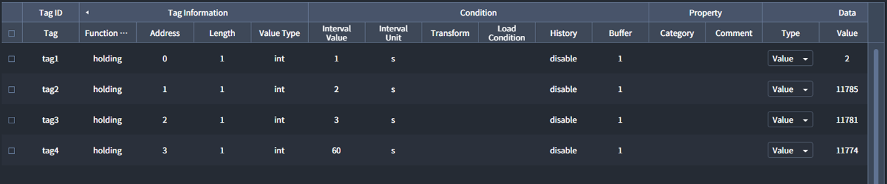
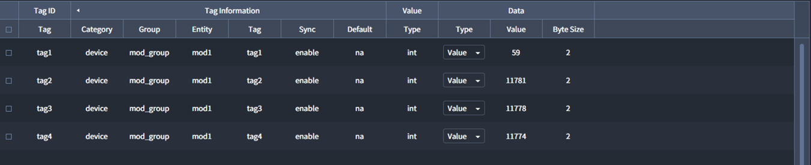
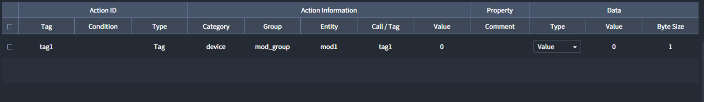

# Sync
- <u>Interactor</u>에서는 동시에 여러 개의 센서 또는 기기에서 데이터를 수집합니다. 
- `Sync`를 이용하면 연관성이 있는 다른 센서/기기의 데이터를 동기화(Synchronization)하여 수집할 수 있습니다. 


## Sync Mode
`Sync`는 데이터 동기화를 위해 Bucket을 만들어 데이터를 수집을 컨트롤합니다. 
데이터는 Interactor로 전달되기 전 Bucket에 도착하여 `Sync > Tags > Tag Information > Sync` 설정 값이 `enable`인 데이터를 기다립니다.

| Option | Description |
| :-: | :- |
| _all_ | `Sync > Tags > Tag Information > Sync`가 `enable`인 값이 모두 도착하면 동작 |
| _any_ | `Sync > Tags > Tag Information > Sync`가 `enable`인 값이 하나라도 도착하면 동작 |

## Connection Information
Sync된 Tag를 CSV File로 저장하는 옵션입니다.

| Key | Description | Required |
| :- | :- | :-: |
| _CSV File Name_ | Tag 데이터를 저장할 CSV 파일명  |  |
| _Recording from_ | 저장 시작 시간 |  |
| _to_ | 저장 마침 시간 |  |

::: tip <p class="custom-block-title">NOTICE</p>
- `Recording from`과 `to`에 값이 하나라도 입력되지 않으면 Tag 데이터는 저장되지 않습니다.
- `Recording from`과 `to`에 입력된 시간이 같을 시 Tag 데이터를 항상 저장합니다.
- 시간은 00:00 ~ 24:00 까지 사용할 수 있습니다.
- 하루를 넘겨 CSV를 저장할 수 있습니다(예시 20:00 ~ 02:00).

:::

- 저장 경로는 다음과 같습니다?
```
C:\project\0625\EdgeHub\interactor\edgehub-i\sync
```

::: warning <p class="custom-block-title">WARNING</p>
- CSV 파일이 열려있는 경우 Tag Data는 저장되지 않습니다. 
- Sync에서 사용되는 Tag가 삭제될 시, Sync 동작과 CSV 파일 Write는 멈추게 됩니다.
:::

## Tags
동기화가 필요한 `Tag`를 추가 및 설정하고 이를 수집합니다.

### Tag ID
동기화에 사용될 Tag를 구분하기 위한 ID입니다.

| Key | Description | Required |
| :- | :- | :-: |
| _Tag_ | <ul><li>Tag를 식별할 수 있는 고유 ID</li><li>CSV 파일 저장 시 컬럼명으로 저장</li></ul> | * |

### Tag Information
동기화에 사용될 Tag를 선택하고 동기화 옵션을 설정합니다.

| Key | Description | Required |
| :- | :- | :-: |
| _Category_ | 동기화할 Tag의 Category 선택 | * |
| _Group_ | 동기화할 Tag의 Group 선택(Category가 Device인 경우만 해당) | * |
| _Entity_ |  동기화할 Tag의 Entity 선택 | * |
| _Tag_ | 동기화할 Tag 선택 | * |
| _Sync_ | 동기화 사용 여부 선택<ul><li>**Enable**: 사용</li><li>**Disable**: 미사용</li></ul> | * |
| _Default_ | 동기화 시 데이터의 default값 <ul><li>**NA**: 공란</li><li>**Latest**: 최신 데이터</li></ul> | * |

::: warning <p class="custom-block-title">WARNING</p>
Tag 동기화를 위해서는 `Tag Information`의 `Sync`가 `enable`인 태그가 최소 하나 이상 필요합니다. 그러므로 최초 생성 태그의 `Sync`는 `enable` 이어야 합니다.
:::

### Value
Tag Value에 대해 설정합니다. 

| Key | Description | Required |
| :- | :- | :-: |
| _Type_ | 동기화에 사용되는 Tag value의 Data Type | * |

###### 자세한 내용은 [Tags 페이지](../general/tags.md)를 참고 바랍니다.

## Actions
- 기존 Action과 달리 Sync가 발생한 시점에서 Action이 실행됩니다.
- Action을 통해 Tag에 값을 쓰면, 제일 최근에 Sync된 값이 써집니다.?
- Action을 통해 Call을 부르면, Sync가 발생한 시점에 Call Query가 실행됩니다.?

###### 자세한 내용은 [Actions 페이지](../general/actions.md)를 참고 바랍니다.


## Tags Example
Tags 사용 예시입니다.

##### 예시) 각각 1,2,3,60초의 Interval로 수집되는 데이터 동기화하기
- `Device > Tags`에서 수집되는 데이터



- `Sync > Tags`에서 동기화 설정



위와 같이 설정하면 Bucket에 먼저 도착한 다른 tag들은 `tag4`의 데이터가 도착할 때까지 기다리게 되어 1분마다 업데이트됩니다.

```
bucket
  |                                          tag4
  |                  tag3 
  |           tag2         
  |    tag1
  ―――――――――――――――――――――――――――――――――――――――――――――――――――――  time
  0     1s     2s     3s       .   .   .      1m
```


## Actions Example
Actions 사용 예시입니다. 

##### 예시) 동기화한 데이터에 Action 추가하기

- `Device > Tags`에서 수집되는 데이터


- `Sync > Tags`에서 동기화 설정


- Actions 설정



위와 같이 설정하면 `tag4`가 Bucket에 도착할 때 `tag1`의 value를 0으로 Write합니다. 
