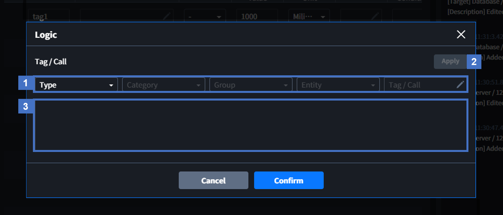
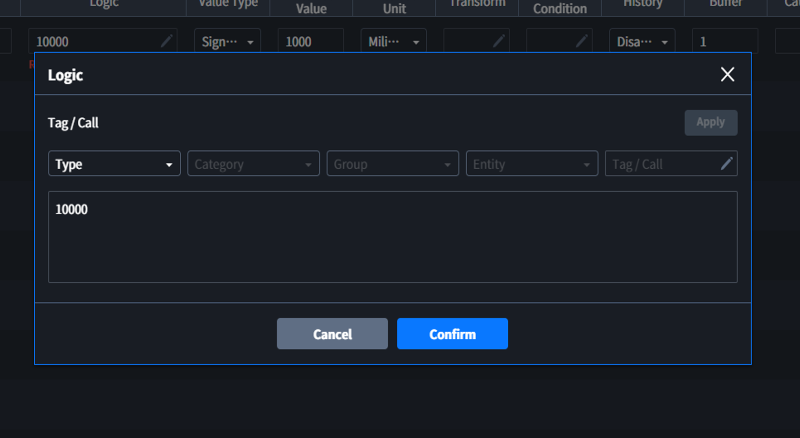
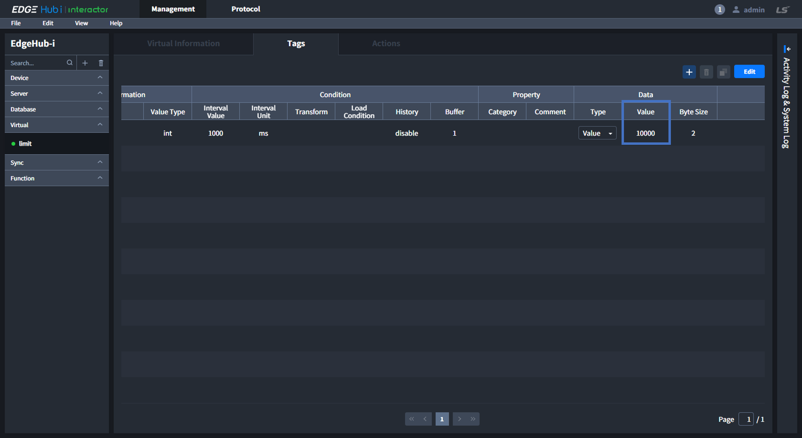
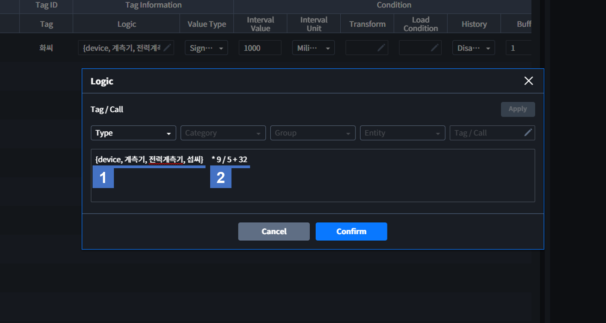
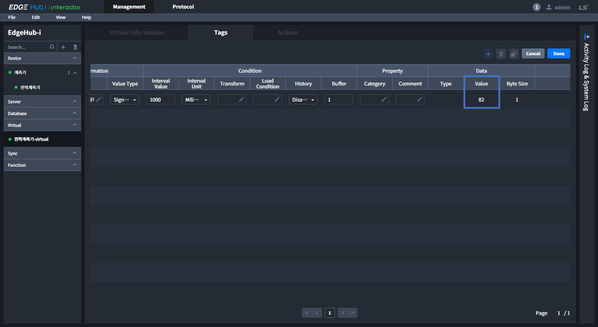
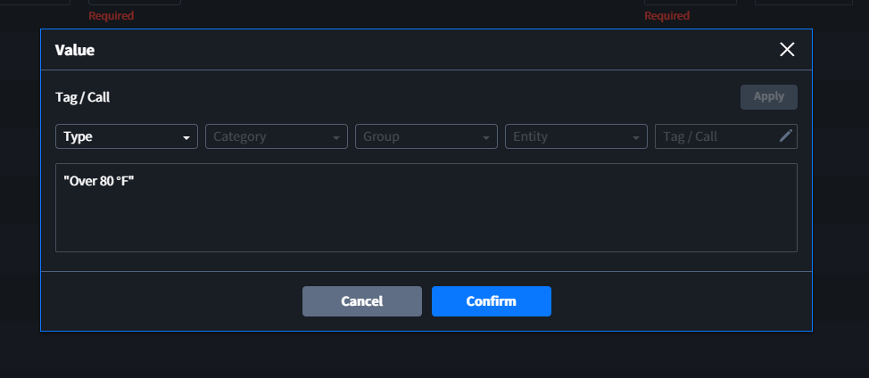

# Virtual
*Virtual*를 통해 다른 *Entity*의 *Tag/Call*을 불러와 가공하거나 [Elixir Syntax](../elixir/elixirSyntax.md)를 이용해 다른 *Entity*에서 사용할 수 있는 *Tag*를 생성할 수 있습니다.

::: tip 
NOTICE

*Virtual Tag*를 만드는 것은 *External Entity*(*Device, Server, Database*)와 대부분 동일하지만, *Tag*의 *Connection Information* 또는 *Tag Information* 같이 대상이 되는 *Entity*의 정보를 입력하는 것과 다르게 *Logic* 에 원하는 값을 직접 입력하여 만듭니다.
:::

## Tags
외부 디바이스와 통신이 아닌 Interactor 내부에서 값을 생성하고, 다른 *Entity*에서 사용할 수 있는 Tag를 만듭니다. 생성된 *Virtual* Tag는 다른 *Entity*에서 `{Tag reference}`로 사용할 수 있습니다.

::: tip 
NOTICE

`Tag Reference`는 `{entity_category, (group_name,) entity_name, tag_ID}`로 구성되며, *Category*가 *Device*인 경우 `group_name`이 포함됩니다.
:::

### Tag Information
- **Logic**: [Elixir Syntax](../elixir/elixirSyntax.md)를 이용해 새로운 값을 생성하거나 다른 *Entity*의 *Tag/Call* 값을 reference하여 이를 가공할 수 있습니다.

  |NO|Description|
  |:-:|:-|
  |1 | SelectBox를 통해 다른 Entity의 Tag나 Call을 선택합니다. |
  |2 | 1번에서 선택한 Tag나 Call의 Reference를 생성하여 3번에 추가합니다. |
  |3 | Elixir문법을 이용하여 원하는 값을 생성하거나 가공할 수 있습니다.|

###### 자세한 내용은 [Tags 페이지](../general/tags.md)를 참고 바랍니다.

## Actions

###### 자세한 내용은 [Actions 페이지](../general/actions.md)를 참고 바랍니다.

## Tags Example

##### 예시1) 고정 데이터 (Staitc) 입력

위와 같이 *Logic*을 입력하여 *Virtual Tag*를 생성하고 *Commit*할 경우 결과는 다음과 같습니다.

#####  예시2) 다른 *Tag*의 데이터 가공 (수집된 온도(℃)를 화씨(°F)로 변환)

  |NO|Description|
  |:-:|:-|
  |1 | Device(Category) > 계측기(Group) > 전력계측기(Entity) > 섭씨(Tag)의 ***Tag Reference*** |
  |2 | 섭씨(℃)를 화씨(°F)로 만들기 위한 공식 `화씨 = 섭씨 * 9 / 5 + 32`|

위와 같이 *Virtual Tag*를 생성하고 *Commit*할 경우 결과는 다음과 같습니다.

## Actions Example

##### 예시) <a href="#exam1">다른 *Tag*의 데이터 가공</a> 예시 에서 만든 화씨 *Tag*의 값이 80이 넘을 경우 Log 기록

