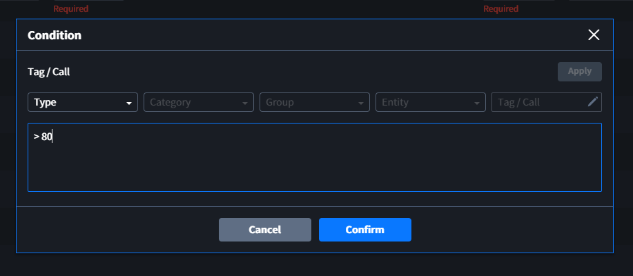

# Virtual
Virtual를 통해 다른 Entity의 Tag/Call을 불러와 가공하거나 [Elixir Syntax](../elixir/elixirSyntax.md)를 이용해 다른 Entity에서 사용할 수 있는 Tag를 생성할 수 있습니다.

::: tip <p class="custom-block-title">NOTICE</p>
Virtual Tag를 만드는 것은 External Entity(Device, Server, Database)와 대부분 동일하지만, Tag의 Connection information 또는 Tag information 같이 대상이 되는 Entity의 정보를 입력하는 것과 다르게 `Logic` 에 원하는 값을 직접 입력하여 만듭니다.
:::

## Virtual Tags
외부 디바이스와 통신이 아닌 Interactor 내부에서 값을 생성하고, 다른 Entity에서 사용할 수 있는 Tag를 만듭니다. 생성된 Virtual Tag는 다른 Entity에서 `{Tag reference}`로 사용할 수 있습니다.

::: tip <p class="custom-block-title">NOTICE</p>
`Tag Reference`는 `{entity_category, (group_name,) entity_name, tag_ID}`로 구성되며, Category가 Device인 경우 `group_name`이 포함됩니다.
:::

### Tag Information
- **Logic**: [Elixir Syntax](../elixir/elixirSyntax.md)를 이용해 새로운 값을 생성하거나 다른 Entity의 Tag/Call 값을 reference하여 이를 가공할 수 있습니다.

  |NO|Description|
  |:-:|:-|
  |1 | SelectBox를 통해 다른 Entity의 Tag나 Call을 선택합니다. |
  |2 | 1번에서 선택한 Tag나 Call의 Reference를 생성하여 3번에 추가합니다. |
  |3 | Elixir문법을 이용하여 원하는 값을 생성하거나 가공할 수 있습니다.|

  <div class="spacer-sm"/>

  ##### 예시1) 고정 데이터 (Staitc) 입력

  

  위와 같이 Logic을 입력하여 Virtual Tag를 생성하고 `Commit`할 경우 결과는 다음과 같습니다.
  

  ##### <span id="exam1"> 예시2) 다른 Tag의 데이터 가공 (수집된 온도(℃)를 화씨(°F)로 변환)</span>

  

    |NO|Description|
    |:-:|:-|
    |1 | Device(Category) > 계측기(Group) > 전력계측기(Entity) > 섭씨(Tag)의 **Tag Reference** |
    |2 | 섭씨(℃)를 화씨(°F)로 만들기 위한 공식 `화씨 = 섭씨 * 9 / 5 + 32`|

  
  위와 같이 Virtual Tag를 생성하고 `Commit`할 경우 결과는 다음과 같습니다.
  

- **Value Type**: Logic을 통해 가공한 데이터의 Value Type을 설정합니다. 

### Condition
- **Interval Value**: Logic을 실행하여 값을 만드는 **시간 간격**
- **Interval Unit**: Interval Value에서 입력한 시간의 **단위**
- **Transform** (Option): Logic에서 생성된 값에 추가적인 변환이 필요할 때 사용
- **Load Condition** (Option): Tag의 값을 Internal Database에 저장하기 위한 조건 설정 (History가 enable인 경우만 사용)
- **History** : Internal Dabase에 Tag 값 저장여부 설정
- **Buffer**: Tag의 값을 임시로 저장하기 위한 버퍼 크기 설정
### Property
- **Category** (Option): 동일한 성질을 가진 Tag의 분류가 필요할 때 사용자가 직접 입력
- **Comment** (Option): Tag의 추가적인 설명이 필요할 때 사용자가 직접 입력

### Data
- **Type**: Data - Value에 출력되는 데이터의 종류 설정 (Raw, Binary, Value 중 선택)
- **Value**: 마지막으로 실행된 Tag 값 (Type 설정 적용)
- **Byte Size**: 마지막으로 실행된 Tag Value의 Byte 길이

<div class="spacer"/>

###### 기타 내용은 [Tags 페이지](../general/tags.md)를 참고 바랍니다.

## Virtual Actions
Tags Tab에서 생성한 Tag에 추가적인 Action을 설정할 수 있습니다. 설정된 Action은 해당 Tag가 실행되는 시점마다 발생합니다.

### Action ID
- **Tag**: Action 실행의 대상이 되는 Tag 선택 (선택된 Tag가 실행 될 때 해당 Action 실행)
- **Condition**: Action이 발생 여부를 결정하는 조건

::: tip <p class="custom-block-title">NOTICE</p>
- Condition의 결과는 True 또는 False여야 하며, 결과가 `True일 경우` Action이 실행됩니다.
- 선택한 Tag의 값이 좌변의 첫 번째 항이 됩니다. 아래와 같이 비교연산자를 바로 사용하거나, 추가적인 산술연산을 할 수 있습니다.
``` elixir

# 아무것도 입력하지 않는 경우 항상 True

# Tag의 값이 1인 경우 True
=== 1 

# TAg의 값이 참조된 TAG의 값과 같을 경우 True
=== {device, GROUP, DEVICE, TAG}

# TAg의 값 + 1이 참조된 TAG의 값과 같을 경우 True
+ 1 === {device, GROUP, DEVICE, TAG}

# Tag의 값이 100보다 크면서 참조된 TAG의 값이 0인 경우 True
> 100 && ({device, GROUP, DEVOCE, TAG} === 0)

# Tag의 값이 if문의 결과값과 같은 경우 True
# if문의 결과: 참조된 TAG가 5보다 작은 경우 본래 TAG 값을, 5와 같거나 그보다 큰 경우 100을 반환
=== if ( {device, GROUP, DEVOCE, TAG} < 5), do: {device, GROUP, DEVOCE, TAG}, else: 100  
```
:::

##### 예시) <a href="#exam1">위의 예시</a>에서 만든 화씨 Tag의 값이 80이 넘을 경우를 조건으로 설정



- **Type**: Action Type을 설정합니다.

| Action | Description |
| :-: | :- |
| Call | 설정한 조건이 만족되면 Call의 Query를 실행합니다. |
| Event | 설정한 조건이 만족되면 Event를 발생시키며 이를 Orchestrator와 Insight에서 확인할 수 있습니다. |
| Log | 설정한 조건이 만족되면 Log를 기록합니다. |
| Tag |  설정한 조건이 만족되면 Tag Value를 Elixir 문법과 함께 원하는 값으로 update합니다. |

::: warning <p class="custom-block-title">WARNING</p>
`Tag + Condition + Type`은 Action의 고유 ID가 되므로 중복될 수 없습니다.
:::

### Action Information
- **Category**: Action 실행의 대상이 되는 Tag 또는 Call의 Category 선택
- **Group**: Action 실행의 대상이 되는 Group 선택 (Category가 Device인 경우만 Group 선택)
- **Entity**: Action 실행의 대상이 되는 Entity 선택
- **Call/Tag**: Action 실행의 대상이 되는 Tag ID 또는 Call ID 선택
- **Value**: Action 실행 시 사용되는 값 입력 (Action Type에 따라 입력되는 내용 다름)  
  - Event / Log: `""` 안에 원하는 message를 입력  
  - Tag: [Elixir Syntax](../elixir/elixirSyntax.md)를 이용하여 대싱아 되는 Tag의 값 변경 또는 Tag가 가르키는 Device에 쓰기 수행

##### 예시) <a href="#exam1">다른 Tag의 데이터 가공</a> 예시 에서 만든 화씨 Tag의 값이 80이 넘을 경우 Log 기록


### Property
- **Comment** (Option): Action의 추가적인 설명이 필요할 때 사용자가 직접 입력

### Data
- **Type**: Data - Value에 출력되는 데이터의 종류 설정 (Raw, Binary, Value 중 선택)
- **Value**: 마지막으로 실행된 Action 값 (Type 설정 적용)
- **Byte Size**:  마지막으로 실행된 Action 값의 Byte 길이


<div class="spacer"/>

###### 기타 내용은 [Actions 페이지](../general/actions.md)를 참고 바랍니다.
