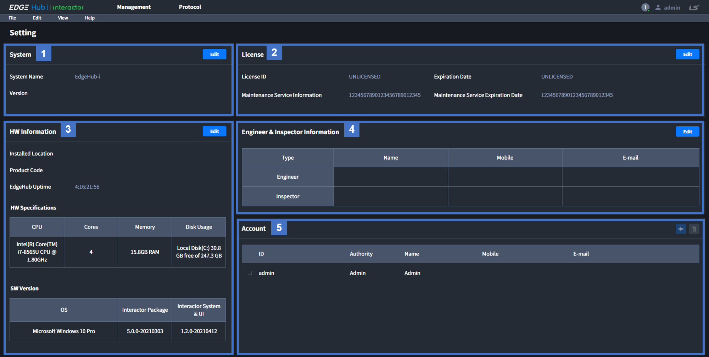

# Web

이 페이지는 Edgegub-i | Interactor web (이하 Interactor)의 사용 방법을 설명합니다.  

## 전체 화면 구조
Login 후 출력되는 화면입니다.   

### 1. Top Navigation Bar (Main)
Management와 Protocol의 페이지이동, Online User 정보 그리고 제품 정보를 확인하기 위한 버튼이 있습니다.  
- Management: 데이터 수집과 관련된 모든 설정을 제공하는 페이지  
- Protocol: 새로운 프로토콜을 추가할 수 있는 페이지  
- Online User: Commit, Edit 정보 및 접속중인 유저 확인 기능  
- Setting: System, License, HW, SW Information 정보 출력 및 Account 관리를 할 수 있는 페이지

### 2. Top Navigation Bar (Sub)
File 가져오기 내보내기, Commit 과 Clear, View 모드 전환 그리고 매뉴얼 확인을 위한 버튼이 있습니다.
- File: 설정한 데이터를 Excel과 .edgehub 파일로 내보내거나 가져오기 기능
- Edit: Web에서 설정한 데이터를 수행하기 위한 Commit과 설정 데이터 초기화를 위한 Clear
- View: 추가/수정/삭제 등의 기능을 사용할 수 있는 Edit 모드와 읽기만 가능한 Read 모드 변환
- Help: 온라인 또는 오프라인 매뉴얼

### 3. Left Navigation Bar
Management 페이지 사용을 위해 Entity 추가/삭제, Entity 상태정보, Entity 페이지 이동을 위한 버튼이 있습니다.

### 4. Content
Top 또는 Left Navigation에서 선택에 따라 내용이 변경되는 메인 화면 입니다.

### 5. Log
Web 사용 기록이 출력되는 Activity Log와 시스템 정보가 출력되는 System Log 화면입니다.  
External Communication 페이지를 제외한 Management 페이지에서는 Log를 접을 수 있습니다.
- Activity Log: 휘발성. 새로고침 시 삭제  
- System Log: Backend에서 수행중인 시스템의 로그. 30초 간격으로 갱신.

## Setting 페이지
제품 정보, 하드웨어 정보 및 사용자 정보를 설정하거나 확인하는 페이지 입니다.  
Top Navigation의 왼쪽에 출력되는 Account ID를 클릭하여, 나오는 메뉴에서 Setting 버튼을 클릭하면 해당 페이지로 이동합니다.

### 1. System
사용자가 입력하는 시스템 정보입니다.  
System Name의 EdgeHub-i로 초기값이 설정되어 있으며, 설정된 값은 Management의 Left Navigation에 출력 됩니다.

### 2. License
Interactor에서 제공하는 License, Expiration Date 정보 입니다.  
Maintenance Service Information, Maintenance Service Expiration Date는 필요한 경우 사용자가 직접 입력하여 사용합니다.  

### 3. HW Information
Interactor가 설치된 HW와 SW에 대한 전반적인 정보를 제공합니다.  
Installed Location과 Production Code는 필요한 경우 사용자가 직접 입력하여 사용합니다.

### 4. Engineer & Inspector Information
Interactor를 사용하는 관리자 정보입니다. 필요한 경우 사용자가 직접 입력하여 사용합니다.

### 5. Account
Login에 사용되는 계정 정보입니다.  
`+` 버튼을 클릭하여 계정을 추가할 수 있습니다.  
자세한 내용은 Account 페이지를 참고해 주세요.  

## Group 페이지
Device Entity의 Group 정보를 출력하는 페이지 입니다.  
Management 페이지에서 Left Navitagion의 Group을 클릭하면 해당 페이지로 이동합니다.

### 1. Group Name  
Entity 생성 시 입력한 Group 이름 입니다.

### 2. Group ON / OFF Button
Group에 속한 모든 Device가 Interactor와 통신을 시작 또는 중지하기 위한 버튼 입니다.
ON 버튼 클릭 시 통신이 중지되어 있는 Device와 통신을 시작하며, OFF 버튼 클릭 시 모든 Device와의 통신을 중지합니다.  
버튼은 Device들의 통신 상태를 나타내지 않습니다.  

### 3. Group Tag Count
Group에 속한 모든 Device에 등록된 Tag의 전체 숫자를 출력합니다.

### 4. Group Description
Group의 세부 정보를 입력할 수 있습니다.

### 5. Device Name
Entity 생성 시 입력한 Device 이름입니다.

### 6. Device Protocol
Device entity에서 선택된 통신 프로토콜 입니다.

### 7. Device Tag Count
Device에 등록된 Tag의 숫자를 출력합니다.

### 8. Device Description
Device Information에서 등록된 Device의 세부정보 입니다.

## Entity Information 페이지
Entity에 적용되는 공통적인 설정 페이지 입니다.  
Management 페이지의 Left Navigation에서 Entity 클릭 후 Content 화면에서 Information 탭을 클릭하면 해당 Content가 출력됩니다.

### 1. Name
사용자가 설정한 Entity 이름입니다.

### 2. Entity ON / OFF Button
Entity와 Edgehub의 통신을 시작하거나 중지하는 버튼입니다. 
Inactive는 통신이 중지되어 있는 상태이며, Active는 통신 중 또는 통신 시도 중인 상태 입니다.  

### 3. Detail
Entity 관련된 정보를 사용자가 입력하고 확인할 수 있습니다.

### 4. Service
Entity와 통신을 위한 프로토콜을 선택합니다.  
카테고리 마다 다른 프로토콜을 제공합니다.  

### 5. Connectoin Info
선택한 Protocol 사용할 때 필요한 공통적인 정보를 설정하기 위해 사용합니다. 
Protocol마다 필요한 설정 항목이 다릅니다.  

### 6. Server Access Control
외부 Client에서 Interactor로 데이터를 요청할 때 아이디와 패스워드 사용하기 위해 사용합니다.
Server Entity에서만 사용하는 기능입니다.  

## Entity Tags 페이지
Interactor에서는 값을 가지는 데이터의 구분을 위해 Tag라는 ID를 사용합니다.  
Tag를 생성할 수 있는 Entity에서 제공되는 페이지 입니다.  
Management 페이지의 Left Navigation에서 Entity 클릭 후 Content 화면에서 Tag 탭을 클릭하면 해당 Content가 출력 됩니다.

## Entity Actions 페이지
Tag가 수집되었을 때 추가적인 동작을 위해 Action을 사용합니다.  
Action을 생성할 수 있는 Entity에서 제공되는 페이지 입니다.  
Management 페이지의 Left Navigation에서 Entity 클릭 후 Content 화면에서 Action 탭을 클릭하면 해당 Content가 출력 됩니다.

## Entity Calls 페이지 
Call은 Database에 사용자가 직접 Query를 작성하여 사용하기를 윈할 때 사용합니다.   
Call을 생성할 수 있는 Entity에서 제공되는 페이지 입니다.  
Management 페이지의 Left Navigation에서 Entity 클릭 후 Content 화면에서 Call 탭을 클릭하면 해당 Content가 출력 됩니다.

## Protocol 페이지
Interactor에서 사용하는 프로토콜을 관리하는 페이지 입니다.  
Built-in 프로토콜 선택 시 Connection Information과 Tag Information을 확인할 수 있습니다.  
사용자가 원하는 프로토콜(Custom Protocol)을 추기/삭제/내보내기/가져오기 할 수 있습니다.
Top Navitagion에서 Protocol 버튼을 클릭하면 해당 페이지로 이동합니다.  

## Protocol Builder 페이지
프로토콜의 세부 정보를 확인하고 Custom Protocol을 설정할 수 있습니다.
Protocol 페이지의 Content 화면에서 프로토콜을 선택하면 해당 페이지로 이동합니다.  

